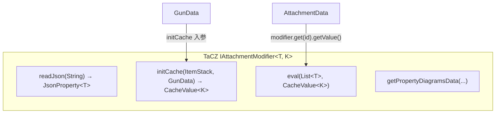
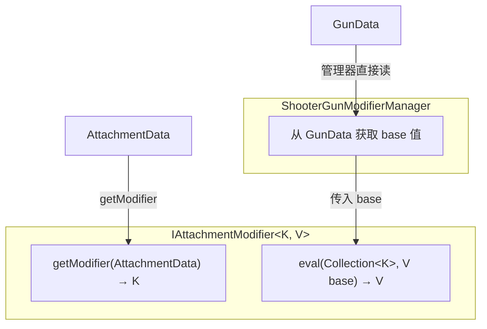
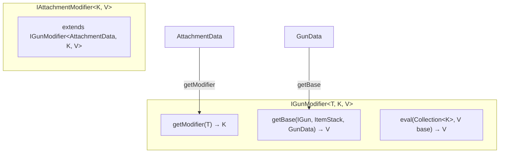
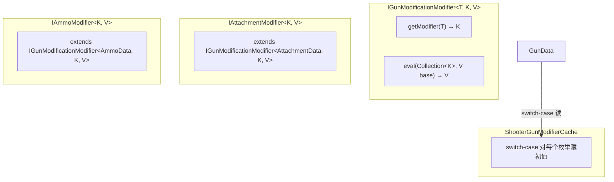
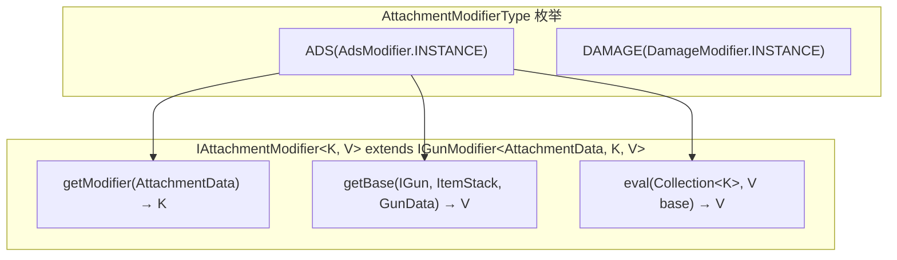
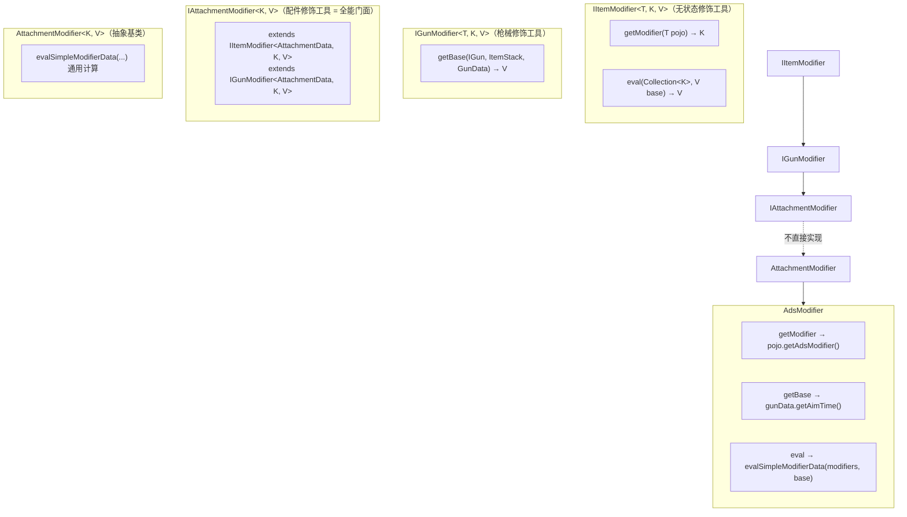

# Modifier 接口设计演进

> 从 TaCZ `IAttachmentModifier<T, K>` 到 CGC `IItemModifier<T,K,V>` → `IGunModifier` → `IAttachmentModifier` 的设计推演过程。记录每种候选方案及其被否决的原因。

---

## 起点：TaCZ 原版



**四个职责混在一个接口里**：JSON 解析（`readJson`）、base 值获取（`initCache` 依赖 GunData）、计算（`eval` 消费 AttachmentData 的数据）、UI。且 `initCache` 和 `eval` 的数据源不同（GunData vs AttachmentData），但都耦合在同一个接口中。

---

## 方案 A：把 initCache 分离，让 IAttachmentModifier 只依赖 AttachmentData



**优点**：接口干净——`getModifier` 只依赖 AttachmentData，`eval` 是纯计算。

**问题**：modifier 不再知道 GunData，那么 base 值从哪里来？需要管理器为每个 modifier 类型单独硬编码 "从 GunData 的哪个字段获取 base 值"。这要么通过 switch-case（丢失类型安全），要么通过另一个接口。

这个方案实际上是**最终方案的前半部分**——但它缺少 base 值获取的类型安全保证。

---

## 方案 B：IGunModifier 含 GunData 初值获取，IItemModifier 去掉



**思路**：`IGunModifier` 同时承担三个职责（getModifier、getBase、eval），`IAttachmentModifier` 直接继承 `IGunModifier<AttachmentData, K, V>`。

**问题**：`getModifier`（从 AttachmentData 读取）和 `getBase`（从 GunData 读取）在语义上服务于不同场景，却耦合在同一个接口里。且 "IItemModifier 限制在 Item 没有必要"——如果以后 Ammo 也有 modifier，`getBase` 涉及到的是 GunData（枪的属性），但 modifier 来源是 Ammo 物品数据，继承 `IGunModifier<AmmoData, K, V>` 显得很奇怪。

---

## 方案 C：IItemModifier 改为 IGunModificationModifier，明确子接口服务的对象



**思路**：重命名 `IItemModifier` → `IGunModificationModifier` 表明服务于 Gun 的 modification。base 值获取在 `ShooterGunModifierCache` 里通过 switch-case 实现。

**问题**：
- "AttachmentModifierType 构造函数里指定服务的 GunModification，但 GunModification 不能是枚举"——如果 GunModification 不是枚举，无法保证类型安全
- switch-case 丢失了强类型对应关系——编译器无法检查 "ADS modifier 对应 gunData.getAimTime()" 是否正确
- "把初值处理在 ShooterGunModifierCache 里做 switch case 实现原解耦目标"——解耦了，但丢失了类型安全

---

## 方案 D：枚举指向具体类，具体类之间做泛型匹配



**思路**：枚举持有具体类实例，具体类的泛型参数 `<K, V>` 在编译期确定——`AdsModifier` 是 `IAttachmentModifier<_SimpleModifierData, Float>`，`FireAspectModifier` 是 `IAttachmentModifier<_FireAspectModifierData, Boolean>`（举例）。`getBase` 从 GunData 获取初值的逻辑在具体类中实现，保证类型安全。

**问题**："想把 initCache 分离掉，但是会丢掉强类型"——`getBase` 放在 `IGunModifier` 接口里意味着每个实现此接口的类都需要知道 GunData，但 `IAttachmentModifier` 的核心语义是 "从 AttachmentData 获取修改值并计算"，`getBase` 的职责其实不属于它。

---

## 最终方案：IAttachmentModifier 额外 implements IGunModifier，作为全能易用门面



### 接口层次

```
IItemModifier<T, K, V>              无状态修饰工具基接口
    ├── getModifier(T pojo) → K      从数据源获取修改值
    └── eval(Collection<K>, V base) → V  纯计算
          ↑
IGunModifier<T, K, V>                枪械修饰（增加 GunData 初值获取）
    └── getBase(IGun, ItemStack, GunData) → V
          ↑
IAttachmentModifier<K, V>            配件修饰（T 绑定 AttachmentData）
    (extends IItemModifier<AttachmentData, K, V> 和
     IGunModifier<AttachmentData, K, V>)
          ⬆ (implements)
AttachmentModifier<K, V>            抽象基类（提供 evalSimpleModifierData 等通用实现）
          ↑
AdsModifier (K=_SimpleModifierData, V=Float)
```

### 设计决策

**"把非 attachment 职责移到别的接口，IAttachmentModifier 作为全能易用门面"**

- `IItemModifier` → 基接口，只有 `getModifier` + `eval`，不指定数据源类型
- `IGunModifier` → 增加 `getBase`（从 GunData 获取初值），独立于 `IItemModifier`
- `IAttachmentModifier` → 同时继承两个接口，作为 "全能易用门面"——调用者拿到一个 `IAttachmentModifier` 实例就能完成全部操作
- 但 `IAttachmentModifier` 内部实现可以**分离**——例如对于简单数值型 modifier，`getModifier` 从 AttachmentData 取值、`getBase` 从 GunData 取值、`eval` 用通用的 `evalSimpleModifierData`，三者各自独立实现

**"内部实现可以分离"** 的含义：
- `getModifier` 和 `getBase` 虽然都在 `IAttachmentModifier` 上，但它们的**实现来源不同**——一个是 `IItemModifier`，一个是 `IGunModifier`
- 同一个具体类（如 `AdsModifier`）实现了两个接口的所有方法，这保证了**编译期的类型安全**：`AdsModifier` 的 `K=_SimpleModifierData` 约束了 `getModifier` 的返回值类型和 `eval` 的输入类型，`V=Float` 约束了 `getBase` 和 `eval` 的值类型

### 为什么不把 IItemModifier 去掉？

IItemModifier 作为最底层的 "无状态修饰工具" 接口保留。它不绑定 Item、不绑定 GunData，是最纯粹的抽象。未来如果出现不是 Item 也不是 Gun 的 modifier 场景（虽然现在没有），可以复用此接口。

### GunProperties 的对应

TaCZ 的 `GunProperties` 类（`GunProperty<T>` record + 常量列表）在 CGC 中没有直接对应。它的功能被拆分到：

| TaCZ GunProperties 职责 | CGC 对应 |
|---|---|
| 属性标识（`name` 字段） | `AttachmentModifierType.typeName` |
| 缓存值类型（`type` 字段） | `IAttachmentModifier<K, V>` 的 `V` 泛型参数（编译期确定） |
| `@CacheModifiableByScript` 标记 | `AttachmentModifierType` 枚举 + `ShooterGunModifierManager` 中的逻辑 |
| `RuntimeOnly` 属性（`String` 常量） | `GunData` 本身的 getter / 或运行时脚本接口 |

这种映射使类型信息从字符串 record 移到了 Java 泛型，获得编译期类型安全。
