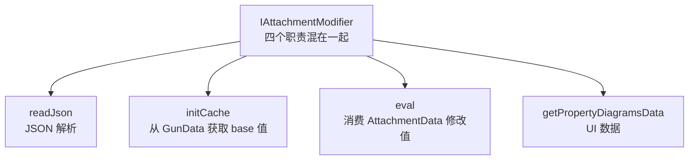
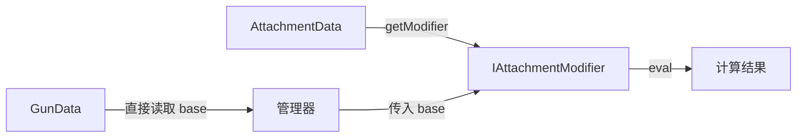
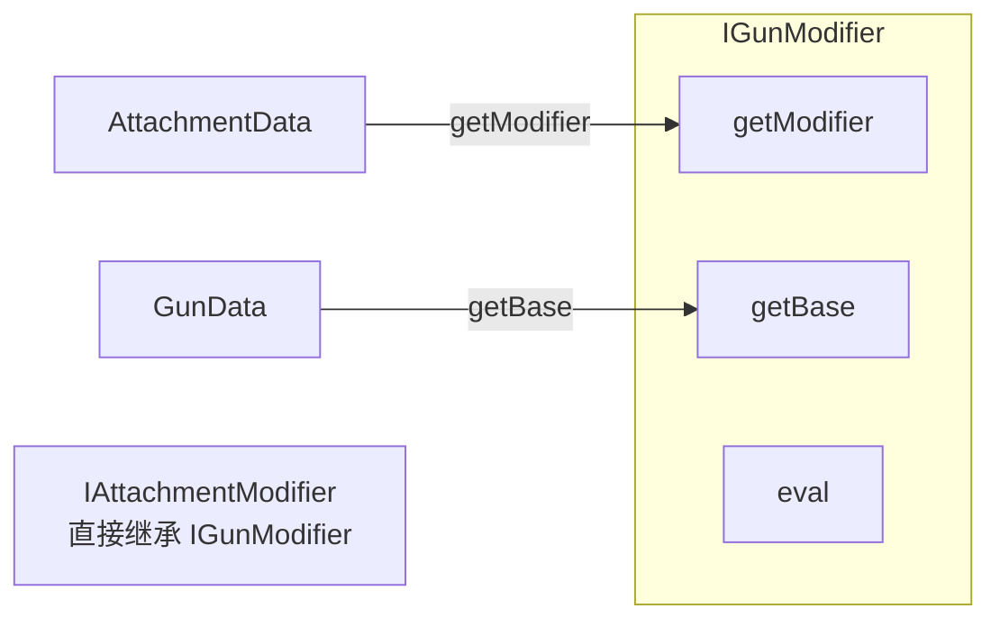
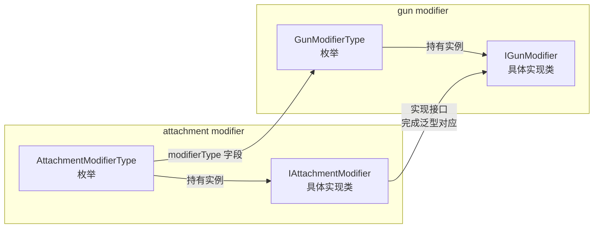
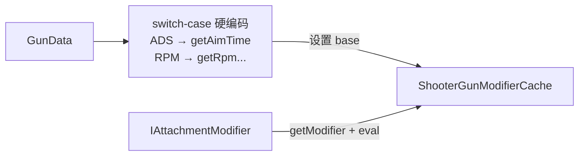
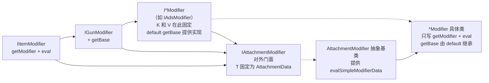

[English](#English)

# Modifier 接口设计演进

> 从 TaCZ `IAttachmentModifier<T, K>` 到 CGC 最终方案的设计推演过程。

## 起点：原版胖接口的问题

核心问题：`initCache` 和 `eval` 的数据源不同（`GunData` vs `AttachmentData`），但都耦合在同一个接口中。

## 候选方案

### 分离 initCache：modifier 只依赖 AttachmentData

管理器用 switch-case 硬编码每个 modifier 对应 `GunData` 的哪个字段，并将 base 值传入 `eval`。modifier 接口只保留 `getModifier(AttachmentData)` 和 `eval(Collection<K>, V base)`。

**否决原因**：运行时硬编码丢失了类型安全——"ADS modifier 对应 `gunData.getAimTime()`" 的正确性完全由程序员保证，编译器无法参与验证。

### IGunModifier 含 GunData 初值获取：用接口继承

`IGunModifier` 在 `IItemModifier` 的基础上增加 `getBase` 方法，作为新的上界。`IAttachmentModifier` 不再继承 `IItemModifier`，改为继承 `IGunModifier`——这样调用方拿到 `IAttachmentModifier` 时也能直接调用 `getBase`。`getModifier`（从 AttachmentData 取）和 `getBase`（从 GunData 取）语义上服务于不同场景却耦合在同一个接口中。具体类仍然要写所有三个方法，没有实现职责分离。

### 枚举持有具体类：两类 modifier 通过接口对应

枪械 modifier 枚举和附件 modifier 枚举各自持有对应的具体实现类。附件 modifier 的类通过实现枪械 modifier 的接口来完成泛型对应。两个枚举之间通过 `modifierType` 字段建立联系——每个 `AttachmentModifierType` 常量指向对应的 `GunModifierType`。

**否决原因**：枚举本身不存泛型，编译器无法通过枚举来保证两个 modifier 类的泛型参数一致。类型安全的验证只能推迟到运行时——区别于最终方案，最终方案在缓存 get/set 时通过 `getValue(IGunModifierHolder, Class<? extends IGunModifier>)` 强制接口泛型匹配，编译期就能捕获类型错误。

### 缓存内 switch-case 赋初值

base 值获取全在 `ShooterGunModifierCache` 里用 switch-case 实现，modifier 接口只保留 `getModifier` + `eval`。

**否决原因**：解耦力度最大，但类型安全损失也最大——编译器完全无法参与验证每个 modifier 与 `GunData` 字段的对应关系。

## 最终方案：胖接口拆分 + 接口 default 代理

CGC 项目中已有三处使用同样的拆分手法：
- `IGunOperator` → `ILivingShooter` 组合多个子接口
- `IGun` → `IGunDataAccess` 族，用 default 方法统一实现
- `GunManager` 对外提供门面，内部由子 Manager 实现

Modifier 体系与此一脉相承：`readJson` 移到 `ResourcePojo.fromJsonReader`，`initCache` 变成 `IGunModifier.getBase`（独立接口），UI 由客户端单独处理，`eval` + 新增 `getModifier` 组成 `IItemModifier` 核心。

### 菱形继承链与泛型匹配

菱形三条路径在 Java 编译器层面强制泛型一致性——如果 `IAdsModifier` 的 `V` 是 `Float` 而 `AttachmentModifier` 的 `V` 是 `Integer`，编译器直接拒绝。具体类只写 `getModifier` 和 `eval`，`getBase` 的职责通过接口 default 方法代理给了 `IAdsModifier`。新增 modifier 只需继承抽象基类 + 实现对应的 `I*Modifier` 接口即可。

## 与 TaCZ 的逐项对比

| 维度 | TaCZ | CGC 最终方案 |
|---|---|---|
| 接口数 | 1 个胖接口（4 方法） | 4 层接口（每层 1-2 方法） |
| base 值获取 | 具体类实现 `initCache` | 接口 `default getBase`，一次定义全继承 |
| 类型安全 | 字符串 ID → 运行时 cast | 泛型 → 编译期检查 + 接口 clash 强制匹配 |
| 具体类职责 | 4 方法全部自己写 | 只写 `getModifier` + `eval` |

TaCZ 的 `GunProperties`（`GunProperty<T>` record + 常量列表）在 CGC 中被拆分：属性标识对应 `GunModifierType.typeName`，缓存类型对应 `I*Modifier` 的泛型参数 `V`（编译期确定类型）。

# English
