[English](#English)

# Modifier 接口设计演进

> 从 TaCZ 到 CGC 最终方案的设计推演过程。

## 起点：原版胖接口的问题

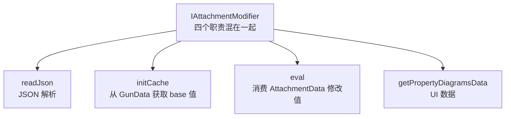

核心问题：`initCache`和`eval`的数据源不同（`GunData` vs `AttachmentData`），但都耦合在同一个接口中。

## 候选方案

### 分离 initCache：modifier 只依赖 AttachmentData

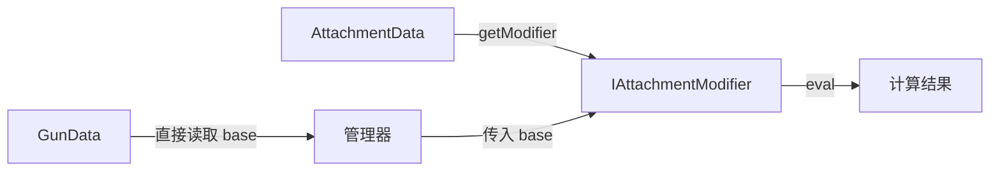

管理器用 switch-case 硬编码每个 modifier 对应`GunData`的哪个字段，并将 base 值传入`eval`。modifier 接口只保留`getModifier`和`eval`。

否决原因：运行时硬编码丢失了类型安全——哪个 modifier 对应`GunData`的哪个字段完全由程序员保证，编译器无法参与验证。

### IGunModifier 含 GunData 初值获取：用接口继承

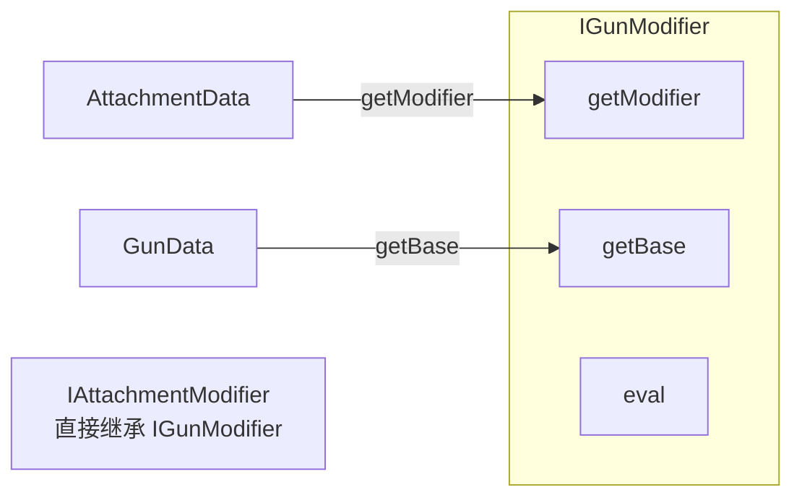

`IGunModifier`在`IItemModifier`的基础上增加`getBase`方法，作为新的上界。`IAttachmentModifier`不再继承`IItemModifier`，改为继承`IGunModifier`——这样调用方拿到`IAttachmentModifier`时也能直接调用`getBase`。`getModifier`（从`AttachmentData`取）和`getBase`（从`GunData`取）语义上服务于不同场景却耦合在同一个接口中。具体类仍然要写所有三个方法，没有实现职责分离。

### 枚举持有具体类：两类 modifier 通过接口对应

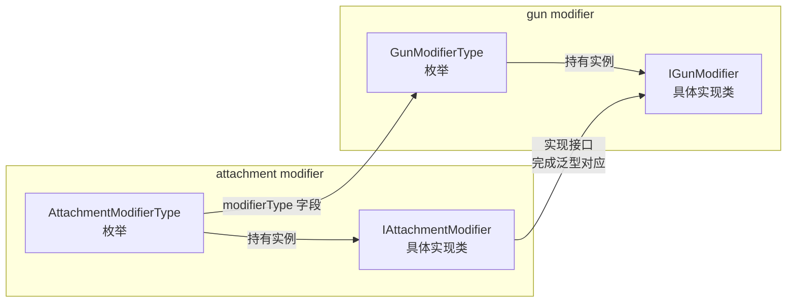

枪械 modifier 枚举和附件 modifier 枚举各自持有对应的具体实现类。附件 modifier 的类通过实现枪械 modifier 的接口来完成泛型对应。两个枚举之间通过`modifierType`字段建立联系。

否决原因：枚举本身不存泛型，编译器无法通过枚举来保证两个 modifier 类的泛型参数一致。类型安全的验证只能推迟到运行时——区别于最终方案，最终方案在缓存读写时通过强制接口泛型匹配，编译期就能捕获类型错误。

### 缓存内 switch-case 赋初值

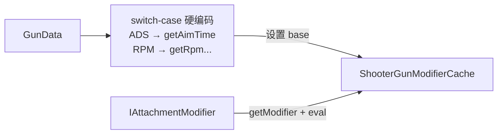

base 值获取全在缓存里用 switch-case 实现，modifier 接口只保留`getModifier`加`eval`。

否决原因：解耦力度最大，但类型安全损失也最大——编译器完全无法参与验证每个 modifier 与`GunData`字段的对应关系。

### 缓存 Class 参数验证：运行时检查 modifier 类型

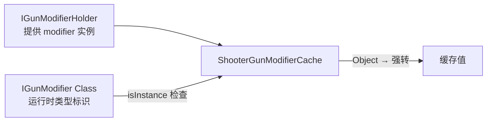

该方案建立在前置拆分之上：`readJson`移到`ResourcePojo.fromJsonReader`，`initCache`变成独立接口方法，UI 由客户端单独处理，`eval`加`getModifier`组成核心。接口通过菱形继承链强制泛型一致性——`I*Modifier`固定`K`和`V`，`IAttachmentModifier`固定`T`为`AttachmentData`，具体类只写`getModifier`和`eval`。

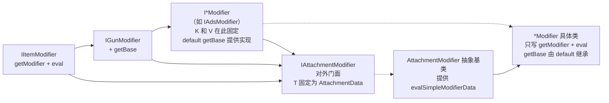

缓存通过`Class`参数指定期望的 modifier 接口，用`isInstance`在运行时检查类型。菱形继承链保证了实现类内部`T`、`K`、`V`的泛型一致性，但当子接口被当作`Class<? extends IGunModifier<T, K, V>>`参数传入时，Java 类型擦除导致`I*Modifier`上已固定的泛型不保留——`Class<IAdsModifier>`只是一个裸`Class`，编译器无法从中恢复`V`的类型来验证缓存值类型是否正确。

否决原因：这是 Java 语言边界——编译器只能验证`Class`本身是否匹配，无法通过`Class`参数推导左值类型，类型错误留到运行时 cast 才能发现。

## 最终方案

胖接口拆分加接口 default 代理，Modifier 体系各职责分离：`readJson`移到`ResourcePojo.fromJsonReader`，`initCache`变成`getBase`（独立接口），UI 由客户端单独处理，`eval`加`getModifier`组成`IItemModifier`核心。

与缓存 Class 参数方案不同，最终方案不再把子接口当作`Class`参数传入缓存，而是让子接口自身提供`static getValue/setValue`：

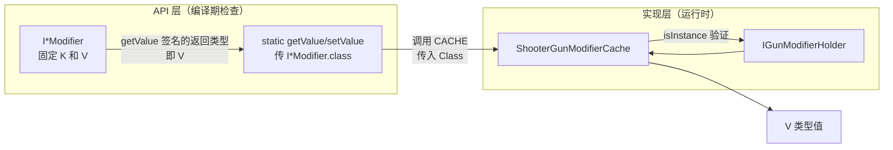

类型约束职责拆分：
- `I*Modifier`子接口固定该属性对应的`K`和`V`，定义公开 API 的泛型契约；
- 子接口内的`static getValue/setValue`将已固定泛型的`I*Modifier.class`传给缓存，调用方无需手动传`Class`；
- `ShooterGunModifierCache`只保存运行时计算值并验证 modifier 实例匹配，不再参与泛型推导。

编译器检查与 API 兼容性：
- 各`I*Modifier`子接口已固定`K`与`V`，其`static getValue`签名保证类型安全——编译器通过子接口的返回类型验证左值`V`，类型错误在编译期即可发现；
- 直接调用`ShooterGunModifierCache#getValue`相当于绕过编译期检查，类型错误会推迟到运行时`ClassCastException`；
- 使用子接口`static getValue`时，若本 API 更新导致签名变化，外部模组只需重新编译即可发现所有不兼容调用点——无需等到运行时从日志排查。

## 与 TaCZ 的逐项对比

|维度|TaCZ|CGC 最终方案|
|---|---|---|
|接口数|1 个胖接口（4 方法）|4 层接口（每层 1 到 2 方法）|
|base 值获取|具体类实现`initCache`|接口 `default getBase`，一次定义全继承|
|类型安全|字符串 ID → 运行时 cast|泛型 → 编译期检查加接口 clash 强制匹配|
|具体类职责|4 方法全部自己写|只写`getModifier`加`eval`|

TaCZ 的`GunProperties`（record 加常量列表）在 CGC 中被拆分：属性标识对应`typeName`，缓存类型对应泛型参数`V`（编译期确定类型）。

# English

> The design progression from TaCZ to the final CGC solution.

## Starting Point: Problems with the Original Fat Interface

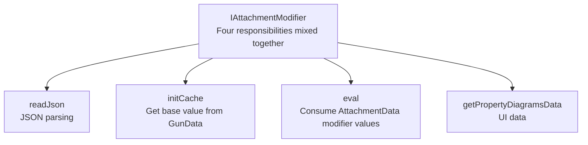

Core problem: `initCache` and `eval` depend on different data sources (`GunData` vs `AttachmentData`) yet are coupled in the same interface.

## Candidate Solutions

### Separate `initCache`: modifier depends only on `AttachmentData`

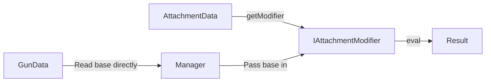

The manager uses `switch-case` to hardcode which `GunData` field each modifier corresponds to, and passes the base value into `eval`. The modifier interface only retains `getModifier` and `eval`.

Rejection reason: runtime hardcoding loses type safety—which modifier corresponds to which `GunData` field is entirely guaranteed by the programmer; the compiler cannot participate in verification.

### IGunModifier includes GunData initial value retrieval: use interface inheritance

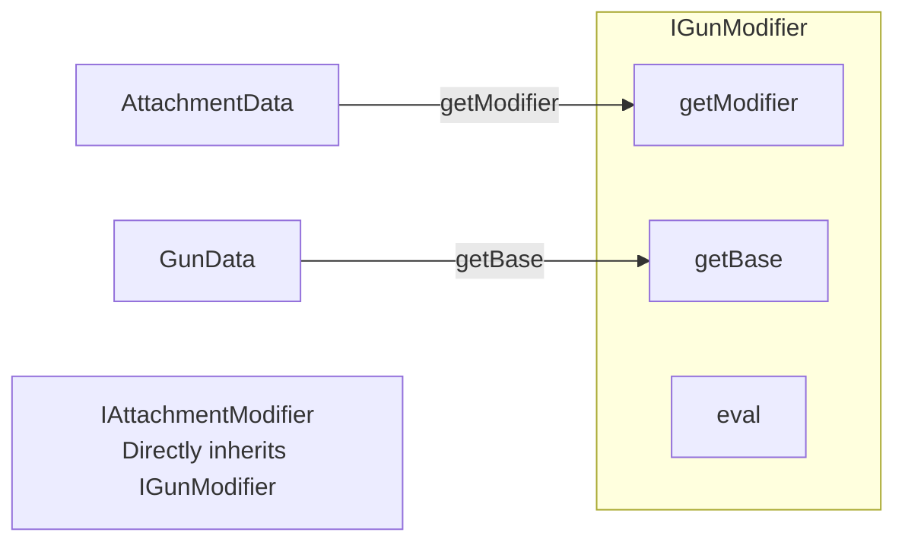

`IGunModifier` adds `getBase` on top of `IItemModifier` as the new upper bound. `IAttachmentModifier` no longer inherits `IItemModifier` but inherits `IGunModifier` instead—so callers who have an `IAttachmentModifier` can also directly call `getBase`. `getModifier` (reads from `AttachmentData`) and `getBase` (reads from `GunData`) serve semantically different scenarios yet are coupled in the same interface. Concrete classes still must write all three methods; no responsibility separation is achieved.

### Enums holding concrete classes: two types of modifiers matched through interfaces

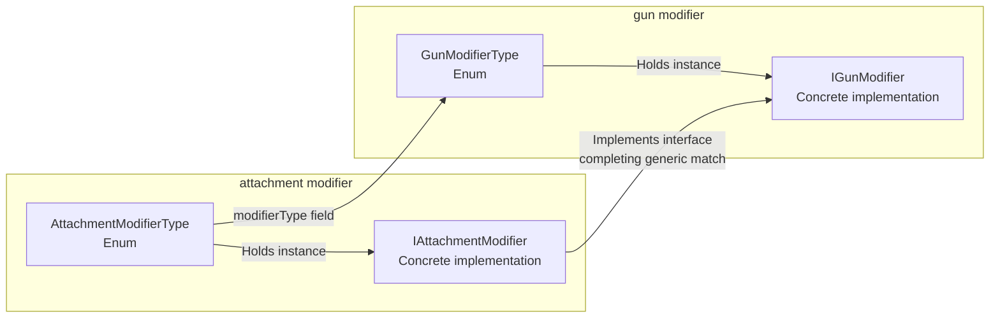

The gun modifier enum and attachment modifier enum each hold their corresponding concrete implementation classes. The attachment modifier class completes the generic match by implementing the gun modifier class's interface. The two enums are connected through the `modifierType` field.

Rejection reason: enums themselves do not carry generics; the compiler cannot use enums to guarantee that the generic parameters of the two modifier classes are consistent. Type safety verification can only be deferred to runtime—unlike the final solution, which enforces interface generic matching at cache read/write time, catching type errors at compile time.

### Switch-case base value assignment in the cache

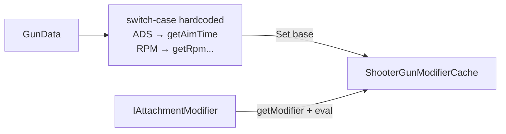

All base value retrieval is implemented with switch-case in the cache, and the modifier interface only retains `getModifier` plus `eval`.

Rejection reason: achieves the greatest decoupling but also loses the most type safety—the compiler cannot participate in verifying the correspondence between each modifier and `GunData` field.

### Cache Class parameter validation: runtime modifier type checking

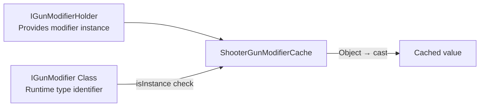

This solution builds on the prior separation: `readJson` moved to `ResourcePojo.fromJsonReader`, `initCache` became a separate interface method, UI handled by the client, with `eval` and `getModifier` forming the core. The diamond inheritance hierarchy enforces generic consistency—`I*Modifier` fixes `K` and `V`, `IAttachmentModifier` fixes `T` to `AttachmentData`, concrete classes only write `getModifier` and `eval`.

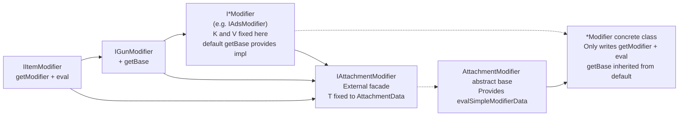

The cache accepts a `Class` parameter to identify the expected modifier interface and uses `isInstance` for runtime type checking. The diamond hierarchy guarantees generic consistency within each implementation class. However, when a sub-interface is passed as `Class<? extends IGunModifier<T, K, V>>`, Java's type erasure means the fixed generics on `I*Modifier` are not preserved—`Class<IAdsModifier>` is a bare `Class` with no generic information, so the compiler cannot recover `V`'s type to verify the cached value type.

Rejection reason: this is a Java language boundary—the compiler can only verify the `Class` itself, not derive the left-hand value type from a `Class` parameter. Type mismatches are only discovered at runtime via casting.

## Final Solution

Fat interface split plus interface default delegation, separating modifier responsibilities: `readJson` moved to `ResourcePojo.fromJsonReader`, `initCache` became `getBase` (separate interface), UI handled by the client, `eval` and `getModifier` form the `IItemModifier` core.

Unlike the Class-parameter approach, the final solution no longer passes sub-interfaces as `Class` arguments to the cache. Instead, sub-interfaces provide their own `static getValue/setValue`:

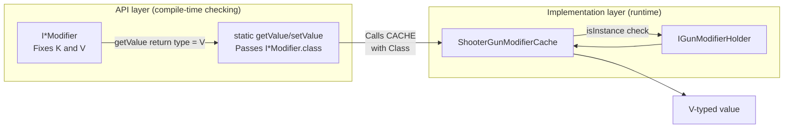

Type constraint responsibility is split:
- `I*Modifier` sub-interfaces fix `K` and `V` for each property, defining the public API's generic contract;
- `static getValue/setValue` within each sub-interface passes the already-fixed `I*Modifier.class` to the cache—callers don't pass `Class` manually;
- `ShooterGunModifierCache` only stores runtime computed values and validates modifier instance matching, no longer involved in generic inference.

Compiler checking and API compatibility:
- Each `I*Modifier` sub-interface already fixes `K` and `V`—its `static getValue` signature guarantees type safety; the compiler verifies the left-hand `V` type through the sub-interface's return type, catching type errors at compile time;
- Calling `ShooterGunModifierCache#getValue` directly bypasses compile-time checking, deferring type errors to runtime `ClassCastException`;
- When using the sub-interface `static getValue`, if an API update changes the signature, external mods only need to recompile to locate all incompatible call sites—no need to dig through runtime logs.

## Side-by-Side Comparison with TaCZ

|Dimension|TaCZ|CGC Final Solution|
|---|---|---|
|Interface count|1 fat interface (4 methods)|4 interface layers (1 to 2 methods each)|
|Base value retrieval|Concrete class implements `initCache`|Interface `default getBase`, defined once, inherited by all|
|Type safety|`String` ID → runtime cast|Generics → compile-time checking plus interface clash enforcement|
|Concrete class responsibility|All 4 methods self-written|Only writes `getModifier` plus `eval`|

TaCZ's `GunProperties` (record plus constant list) is split in CGC: property identity maps to `typeName`, and cache type maps to generic parameter `V` (compile-time determined type).
