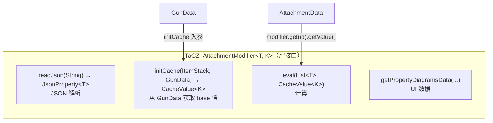
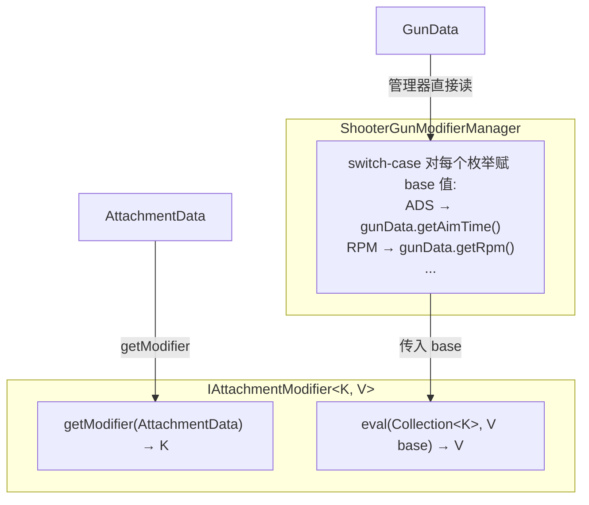
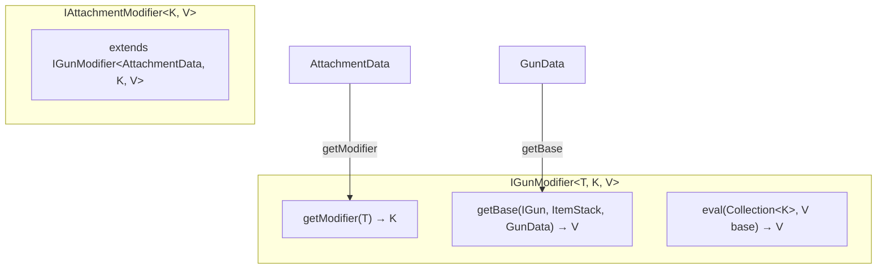
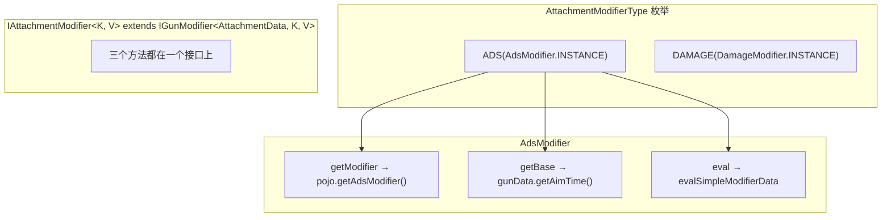
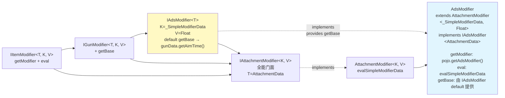

# Modifier 接口设计演进

> 从 TaCZ `IAttachmentModifier<T, K>` 到 CGC 最终方案的设计推演过程。记录每种候选方案及其被否决的原因。

---

## 起点：TaCZ 原版 IAttachmentModifier 的问题



**四个职责混在一个接口里**：JSON 解析（`readJson`）、base 值获取（`initCache` 依赖 GunData）、计算（`eval` 消费 AttachmentData 的数据）、UI。核心问题是 `initCache` 和 `eval` 的数据源不同（GunData vs AttachmentData），但都耦合在同一个接口中。

**关于 GunProperties**：TaCZ 的 `GunProperties` 类定义了一系列 `GunProperty<T>` record 常量（如 `ADS_TIME`、`DAMAGE`、`RECOIL` 等），本质上是类型安全的缓存 key。在 CGC 重构中，其功能被拆分：属性标识对应 `GunModifierType.typeName`，缓存类型对应 `I*Modifier` 的泛型参数 `<K, V>`（编译期确定类型）。`@CacheModifiableByScript` 和 `@ValueModifiableAtRuntime` 注解标记了可被 Lua 脚本修改的属性。

---

## 方案 A：把 initCache 分离，让 IAttachmentModifier 只依赖 AttachmentData



**优点**：接口干净——`getModifier` 只依赖 AttachmentData，`eval` 是纯计算。

**否决原因**：管理器需要 switch-case 硬编码 "每个 modifier → GunData 的哪个字段"。编译器无法检查 "ADS modifier 对应 `gunData.getAimTime()`" 是否正确——丢失了类型安全。

---

## 方案 B：IGunModifier 含 GunData 初值获取，IItemModifier 去掉



**思路**：`IGunModifier` 同时承担三个职责，`IAttachmentModifier` 直接继承。

**否决原因**：`getModifier`（从 AttachmentData 取）和 `getBase`（从 GunData 取）语义上服务于不同场景却耦合在同一个接口中。具体类仍然要写所有三个方法，没有实现职责分离。

---

## 方案 C：枚举指向具体类，具体类之间做泛型匹配



**思路**：枚举持有具体类实例。`AdsModifier` 自己实现 `getBase`。

**否决原因**：接口是拆分了（`IItemModifier` + `IGunModifier`），但**具体实现类还是承担了所有职责**——`getBase` 的代码仍然写在 `AdsModifier` 里。分离只发生在接口声明层，没有发生在实现层。

---

## 方案 D：ShooterGunModifierCache 内 switch-case 赋初值

**思路**：base 值获取全在 `ShooterGunModifierCache` 里用 switch-case 实现，modifier 接口只保留 `getModifier` + `eval`。

**否决原因**：switch-case 丢失了强类型对应——"ADS modifier 对应 `gunData.getAimTime()`" 的正确性完全由程序员保证，编译器无法参与。这个方案的解耦力度最大，但类型安全损失也最大。

---

## 最终方案：胖接口拆分 + 接口 default 代理

### 设计来源：已有重构手法

CGC 项目中已有三处使用相同的胖接口拆分手法：

| 已有重构 | 拆分方式 |
|---|---|
| **IGunOperator → ILivingShooter** | TaCZ 的 `IGunOperator` 拆成 `IGunOperator`、`IShooterState`、`ISynGunState`、`IShooterModifierCacheHolder`。`ILivingShooter extends` 所有子接口，对外不变 |
| **IGun → IGunDataAccess 族** | TaCZ 的 `IGun` 拆成 `IGunStateAccess`、`IGunAmmoDataAccess`、`IGunAttachmentDataAccess` 等。`GunDataAccessor` 用 `default` 方法统一实现，用注释分隔各接口 |
| **Gun/Projectile Manager 组** | `GunManager` 对外提供 `IGunManager` 门面，内部由四个子 Manager 实现，属于内部实现分离 |

Modifier 体系的拆分方式与此一脉相承：
- `readJson` → 移到 `ResourcePojo.fromJsonReader`
- `initCache` → 变成 `IGunModifier.getBase`（独立接口）
- UI → 客户端单独处理
- `eval` + 新增 `getModifier` → 组成 `IItemModifier` 核心

### 菱形继承链与泛型匹配



**三条菱形路径**：

```
路径1: AdsModifier → AttachmentModifier → IAttachmentModifier → IItemModifier
路径2: AdsModifier → AttachmentModifier → IAttachmentModifier → IGunModifier → IItemModifier
路径3: AdsModifier → IAdsModifier → IGunModifier → IItemModifier
```

**路径3是新增的**——`AdsModifier implements IAdsModifier<AttachmentData>`。`IAdsModifier` 通过 `default getBase` 提供了 base 值获取的实现，`AdsModifier` 类中完全不写 `getBase`。`IAdsModifier` 虚线箭头的 `implements` 关系标注了 `provides getBase`，明确这个职责的来源。

### 接口 clash 强制泛型匹配 — 在 ShooterGunModifierCache 中的应用

`ShooterGunModifierCache.getValue(IGunModifierHolder, Class<? extends IGunModifier<T,K,V>>)` 方法利用菱形继承的泛型约束来保证类型安全：

- `modifierType.getGunModifier()` 返回 `IGunModifier` 实例
- `modifierClass.isInstance(...)` 运行时验证实例是否实现了指定的子接口
- 返回值的类型 `V` 由 `modifierClass` 的泛型参数推断

这要求调用者传入正确的子接口类型——例如对 ADS 必须传 `IAdsModifier.class`，传错则运行时日志报错。

```
IAdsModifier<T> extends IGunModifier<T, _SimpleModifierData, Float>
    → K = _SimpleModifierData（固定）
    → V = Float（固定）

AdsModifier extends AttachmentModifier<_SimpleModifierData, Float>
            implements IAdsModifier<AttachmentData>
    → T = AttachmentData（固定）
    → K = _SimpleModifierData（两条路径都必须满足）
    → V = Float（两条路径都必须满足）
```

如果 `IAdsModifier` 的 `V` 是 `Integer` 而 `AttachmentModifier` 的 `V` 是 `Float`，Java 编译器直接拒绝。"接口 clash 强制类型匹配"——编译期保证所有路径上泛型一致。

### "内部实现分离"的含义

`IAttachmentModifier` 是对外的全能门面（调用者拿到它就够了）。但内部实现被分离到不同层级：

- `IAdsModifier.default getBase` → base 值从 GunData 取（接口层）
- `AttachmentModifier.evalSimpleModifierData` → 通用数值计算（抽象基类层）
- `AdsModifier.getModifier` → 从 AttachmentData 取值（具体类层）

具体类里没有 base 值获取的代码——这个职责通过接口 default 方法**代理**给了 `IAdsModifier`。

---

## 与 TaCZ 的逐项对比

| 维度 | TaCZ | CGC 最终方案 |
|---|---|---|
| 接口数 | 1 个胖接口（4 方法） | 4 层接口（每层 1-2 方法） |
| base 值获取 | 具体类实现 `initCache(gunItem, gunData)` | `I*Modifier` 接口 `default getBase`（一次定义，所有实现类继承） |
| 类型安全 | 字符串 ID → 运行时 cast | 泛型 `<K,V>` → 编译期检查 + 接口 clash 强制匹配 |
| 具体类职责 | 4 方法全部自己写 | 只写 `getModifier` + `eval`（`getBase` 由接口 default 代理） |
| 新增 modifier | 实现完整接口 | 继承 `AttachmentModifier<K,V>` + 实现对应 `I*Modifier<AttachmentData>` |

### GunProperties 的对应

TaCZ 的 `GunProperties`（`GunProperty<T>` record + 常量列表）在 CGC 中被拆分：

| TaCZ | CGC |
|---|---|
| 属性标识 `name` | `GunModifierType.typeName` |
| 类型 `type` | `I*Modifier` 的 `V` 泛型参数 |
| `@CacheModifiableByScript` | `GunModifierType` 枚举 + `ShooterGunModifierManager` 逻辑 |
| `RuntimeOnly` | `GunData` getter / 运行时脚本接口 |
