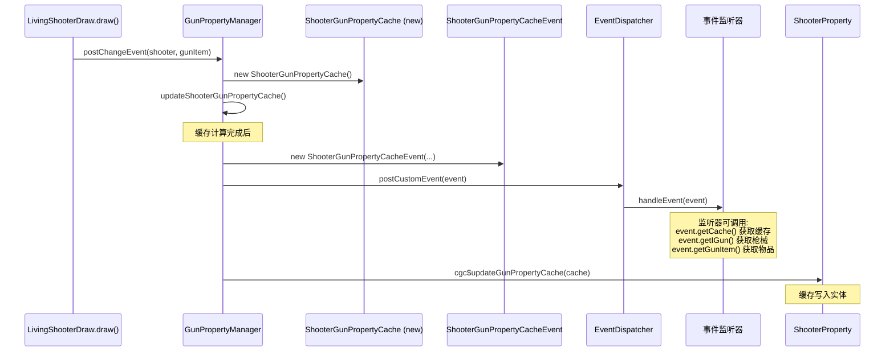

# 事件与通知系统 — CGC 重构版

> `ShooterGunPropertyCacheEvent` 事件设计，自定义事件派发流，与 TaCZ Forge 事件系统的对比。

## 事件定义

`xiao.customgun.core.api.event.shooter.ShooterGunModifierCacheEvent`

```java
public final class ShooterGunPropertyCacheEvent extends LivingShooterEvent implements IGunEvent {
    private final @NotNull IGun iGun;
    private final @NotNull ItemStack gunItem;
    private final @NotNull ShooterGunPropertyCache cache;  // 监听器可修改

    public ShooterGunPropertyCacheEvent(
        McLogicalSide logicalSide,
        @NotNull ILivingShooter iLivingShooter, @NotNull LivingEntity livingShooter,
        @NotNull IGun iGun, @NotNull ItemStack gunItem,
        @NotNull ShooterGunPropertyCache cache);
}
```

### 事件类型

在 `CustomEventType` 枚举中注册：

```java
SHOOTER_GUN_PROPERTY_CACHE_EVENT(ShooterGunPropertyCacheEvent.class)
```

### 继承层次

```
CustomEvent
  └── LivingShooterEvent (ILogicalSideOnly, ILivingShooterEvent)
        └── ShooterGunPropertyCacheEvent (IGunEvent)
```

- `ILogicalSideOnly` — 标记事件的逻辑端（服务端/客户端）
- `ILivingShooterEvent` — 提供 `getILivingShooter()` 和 `getLivingShooter()`
- `IGunEvent` — 提供 `getIGun()` 和 `getGunItem()`

### 事件分发器

```java
private static final EventDispatcher<...> _EVENT_DISPATCHER =
    CustomGun.getEventPoster().getEventDispatcher(ShooterGunPropertyCacheEvent.class);
```

事件分发器在类加载时初始化，之后复用。监听器通过 `_EVENT_DISPATCHER` 注册/取消。

## 事件触发时机



**关键时序**：事件在缓存计算完成之后、写入实体之前触发。这意味着：
- 监听器看到的是计算后的缓存值
- 监听器可以修改 `event.getCache()` 来覆盖默认计算结果
- 修改后的缓存最终写入实体

## 与 TaCZ 事件系统的对比

| 维度 | TaCZ | CGC |
|---|---|---|
| 事件类 | `AttachmentPropertyEvent extends Forge Event` | `ShooterGunPropertyCacheEvent extends CustomEvent` |
| 事件总线 | Forge `MinecraftForge.EVENT_BUS` | CGC `EventPoster` + `EventDispatcher` |
| 事件注册 | `@SubscribeEvent` 注解 | `ICustomEventHandler` 接口实现 |
| KubeJS 支持 | 通过 `KubeJSGunEventPoster` 接口 | 通过 CGC 事件系统的脚本桥接 |
| LogicSide 过滤 | 监听器中手动检查 | `McLogicalSide` 传递给事件，由 Dispatcher 过滤 |
| 内部处理 | `ChangeGunPropertyEvent.internalOnAttachmentPropertyEvent`（在 Forge 事件前） | `updateShooterGunPropertyCache()` 在事件前完成 |

### CGC 事件系统的优势

1. **类型安全**：每个事件类型由 `CustomEventType` 枚举标识，编译期可追踪
2. **事件分发效率**：`EventDispatcher` 为每个事件类型独立维护监听器列表，不需要遍历全局总线
3. **接口化监听**：监听器实现 `ICustomEventHandler` 接口，通过泛型提供类型安全
4. **自定义生命周期管理**：`IHookManageable` 和 `IEventListener` 接口允许监听器按生命周期自动注册和注销

## 事件使用的 TODO 项

`GunPropertyManager.postChangeEvent()` 中第 48-51 行：

```java
{
    ShooterProperty shooterProperty = iLivingShooter.cgc$getShooterProperty();
    // TODO GunProperties移植 (待定, 目前迁移映射里为 
    //   xiao.customgun.core.api.projectile.IProjectileRuntime.StateCache.*)
}
```

这对应 TaCZ 中 `AttachmentPropertyManager.postChangeEvent()` 的步骤 4（脚本修改缓存值）。CGC 需要：
1. 确定哪些属性支持脚本修改（对应 TaCZ 的 `@CacheModifiableByScript`）
2. 确定脚本修改的 API（对应 TaCZ 的 `iGun.modifyProperty()`）
3. 实现在事件触发后、写入实体前的脚本修改逻辑
