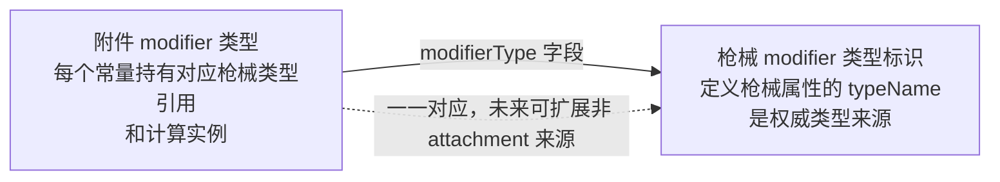
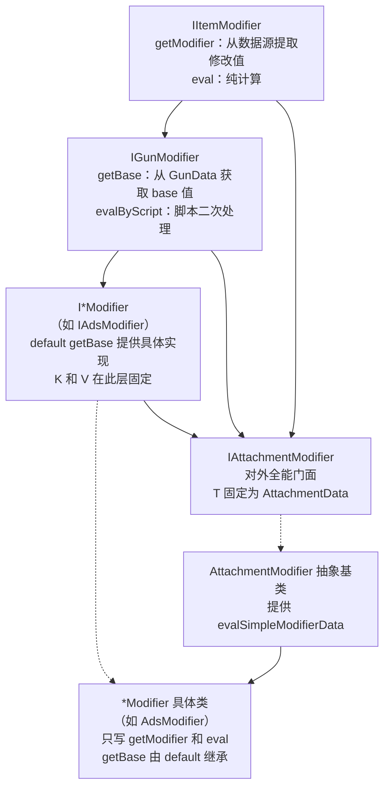
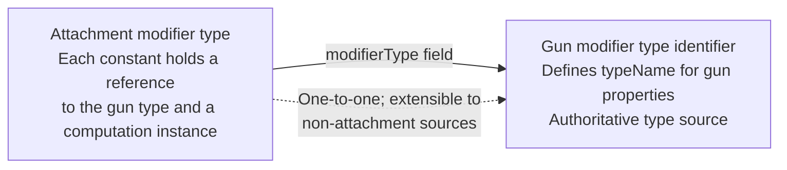
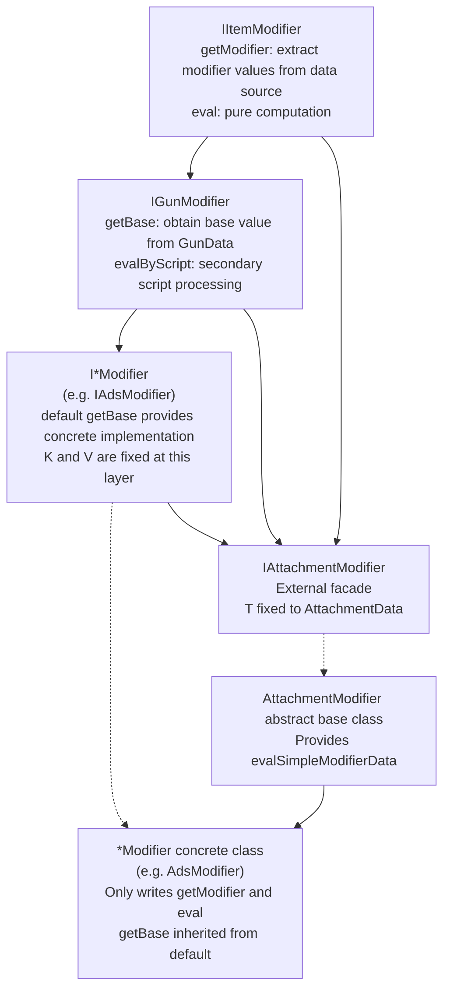

[English](#English)

# 枚举类型设计

> CGC 用编译期类型安全的枚举替代运行时字符串键来标识和访问配件修改器。附件 modifier 枚举附属于枪械 modifier 枚举，每个附件 modifier 对应到一个枪械 modifier 类型。

## 两个枚举的关系

`GunModifierType`定义枪械属性的类型标识（`typeName`），是 gun modifier 的权威类型来源。未来任何来源（attachment、ammo 等）的 gun modifier 都指向它。

`AttachmentModifierType`继承该标识——每个常量持有对应的`GunModifierType`引用和`IAttachmentModifier`计算实例。当前两者一一对应。

## 接口层次

modifier 的计算职责通过多层接口分离：

`IAdsModifier`通过`default getBase`提供 base 值获取的实现，一次定义，所有实现类继承——具体类中完全不写`getBase`代码。这个职责通过接口 default 方法代理给了`IAdsModifier`，具体类只写`getModifier`和`eval`。

`IAttachmentModifier`是对外的全能门面，但内部实现被分离到不同层级（接口 default、抽象基类、具体类）。

## 类型标识接口

`GunModifierType`枚举和`AttachmentModifierType`枚举都实现了`IGunModifierType`（后者通过`IGunModifierHolder`间接实现）。未来非 attachment 来源的 modifier 也可实现此接口来声明服务于哪个枪械属性。

# English

> CGC replaces runtime string keys with compile-time type-safe enums for identifying and accessing attachment modifiers. The attachment modifier enum is affiliated with the gun modifier enum; each attachment modifier corresponds to a gun modifier type.

## Relationship Between the Two Enums

`GunModifierType` defines the type identifier (`typeName`) for gun properties and is the authoritative type source for gun modifiers. All future gun modifier sources (attachment, ammo, etc.) will point to it.

`AttachmentModifierType` inherits this identity—each constant holds the corresponding `GunModifierType` reference and an `IAttachmentModifier` computation instance. The two are currently one-to-one.

## Interface Hierarchy

The modifier's computation responsibilities are separated across multiple interface layers:

`IAdsModifier` provides the base value retrieval implementation through `default getBase`—defined once, inherited by all implementing classes. The concrete class contains no `getBase` code at all. This responsibility is delegated to `IAdsModifier` through interface default methods; the concrete class only writes `getModifier` and `eval`.

`IAttachmentModifier` is the external facade, but its internal implementation is separated across different layers (interface default, abstract base class, concrete class).

## Type Identifier Interface

Both `GunModifierType` and `AttachmentModifierType` implement `IGunModifierType` (the latter indirectly through `IGunModifierHolder`). Future modifiers from non-attachment sources can also implement this interface to declare which gun property they serve.
