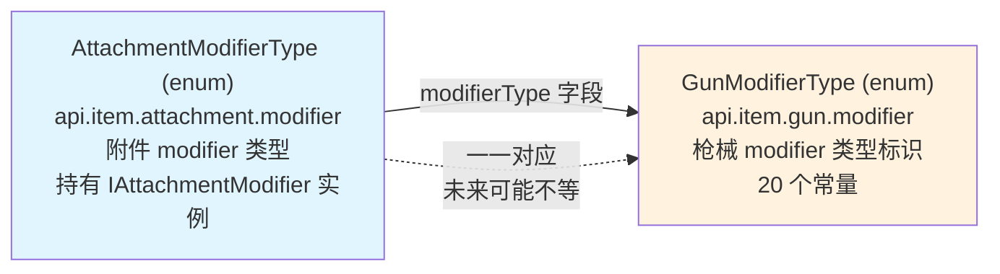

# AttachmentModifierType 枚举

> CGC 用编译期类型安全的枚举替代 TaCZ 运行时字符串键来标识和访问配件修改器。`AttachmentModifierType` 附属于 `GunModifierType`——每个附件 modifier 对应到一个枪械 modifier 类型。

## 与 GunModifierType 的关系



`AttachmentModifierType` 的每个常量对应一个 `GunModifierType`：
- `GunModifierType` 定义**枪械属性**的类型标识（typeName）
- `AttachmentModifierType` 继承该标识，并持有对应的 `IAttachmentModifier` 计算实例

TaCZ 原版的 `AttachmentPropertyManager.MODIFIERS` Map 在此体系中对应 `AttachmentModifierType` 枚举——当前所有 gun modifier 都被 attachment modifier 一一对应实现，但未来新增的 gun modifier 不一定有对应的 attachment modifier。

## 枚举结构

```java
public enum AttachmentModifierType implements ResourceTag.CategoryTag, IGunModifierType {
    ADS(GunModifierType.ADS, AdsModifier.INSTANCE),
    DAMAGE_CALCULATION(GunModifierType.DAMAGE_CALCULATION, DamageCalculationModifier.INSTANCE),
    // ...

    public final GunModifierType modifierType;     // 对应的枪械 modifier 类型
    public final String typeName;                   // 从 modifierType 继承
    public final IAttachmentModifier<?, ?> modifier; // 计算实例
}
```

每个枚举常量的构造函数接受两个参数：

| 参数 | 类型 | 含义 |
|---|---|---|
| `type` | `GunModifierType` | 此附件 modifier 对应的枪械属性类型 |
| `modifier` | `IAttachmentModifier<K, V>` | 实现 getModifier / getBase / eval 的计算实例 |

`IGunModifierType` 接口提供 `getGunModifierType()` 方法，使得 `AttachmentModifierType` 可以被统一查询其服务的枪械属性。

## 枚举常量完整列表

所有 20 个常量均已迁移完成，全部持有 `INSTANCE` 单例：

| 枚举常量 | GunModifierType | modifier INSTANCE |
|---|---|---|
| `ADS` | `GunModifierType.ADS` | `AdsModifier` |
| `DAMAGE_CALCULATION` | `GunModifierType.DAMAGE_CALCULATION` | `DamageCalculationModifier` |
| `HEADSHOT_MULTIPLIER` | `GunModifierType.HEADSHOT_MULTIPLIER` | `HeadshotMultiplierModifier` |
| `ARMOR_IGNORE_PERCENT` | `GunModifierType.ARMOR_IGNORE_PERCENT` | `ArmorIgnoreModifier` |
| `BULLET_SPEED` | `GunModifierType.BULLET_SPEED` | `BulletSpeedModifier` |
| `PIERCE_COUNT` | `GunModifierType.PIERCE_COUNT` | `PierceCountModifier` |
| `FIRE_ASPECT` | `GunModifierType.FIRE_ASPECT` | `FireAspectModifier` |
| `KNOCKBACK_STRENGTH` | `GunModifierType.KNOCKBACK_STRENGTH` | `KnockbackStrengthModifier` |
| `BULLET_EXPLOSION` | `GunModifierType.BULLET_EXPLOSION` | `BulletExplosionModifier` |
| `RPM` | `GunModifierType.RPM` | `RpmModifier` |
| `RECOIL_DATA` | `GunModifierType.RECOIL_DATA` | `RecoilDataModifier` |
| `EFFECTIVE_RANGE` | `GunModifierType.EFFECTIVE_RANGE` | `EffectiveRangeModifier` |
| `WEIGHT` | `GunModifierType.WEIGHT` | `WeightModifier` |
| `MUZZLE` | `GunModifierType.MUZZLE` | `MuzzleModifier` |
| `AIM_INACCURACY` | `GunModifierType.AIM_INACCURACY` | `AimInaccuracyModifier` |
| `SNEAK_INACCURACY` | `GunModifierType.SNEAK_INACCURACY` | `SneakInaccuracyModifier` |
| `PRONE_INACCURACY` | `GunModifierType.PRONE_INACCURACY` | `ProneInaccuracyModifier` |
| `OTHER_INACCURACY` | `GunModifierType.OTHER_INACCURACY` | `OtherInaccuracyModifier` |
| `MELEE` | `GunModifierType.MELEE` | `MeleeModifier` |
| `MAGAZINE_CATEGORY` | `GunModifierType.MAGAZINE_CATEGORY` | `MagazineCategoryModifier` |

## 接口层次

```
IItemModifier<T, K, V>                        无状态修饰工具
    ├── getModifier(T pojo) → K
    └── eval(Collection<K>, V base) → V
          ↑
IGunModifier<T, K, V>                         枪械修饰（声明 getBase）
    └── getBase(IGun, ItemStack, GunData) → V
          ↑
I*Modifier<T> (如 IAdsModifier)               getBase 的 default 实现
          ↑
IAttachmentModifier<K, V>                     配件修饰门面（T=AttachmentData）
          ⬆
AttachmentModifier<K, V>                      抽象基类（evalSimpleModifierData）
          ↑
*Modifier (如 AdsModifier)                    具体类（getModifier + eval）
```

## IGunModifierType 接口

```java
public interface IGunModifierType {
    GunModifierType getGunModifierType();
}
```

`GunModifierType` 枚举和 `AttachmentModifierType` 枚举都实现了此接口。这使得：
- `GunModifierType.ADS.getGunModifierType()` → 返回自身
- `AttachmentModifierType.ADS.getGunModifierType()` → 返回 `GunModifierType.ADS`

未来如果出现非 attachment 来源的 gun modifier（如 ammo modifier），也可以实现 `IGunModifierType` 来声明它服务于哪个枪械属性。

## AttachmentDataTag — 即将移除

`AttachmentDataTag` 中的所有常量现在都直接引用 `GunModifierTypeTag` 的同名字段。OLD1 变体仍保留在 `AttachmentDataTag` 中用于 JSON 向后兼容，但标签值的权威来源已转移到 `GunModifierTypeTag`。`AttachmentDataTag` 计划在后续重构中移除，OLD1 变体将迁移到 `AttachmentData.fromJsonReader` 内部。
