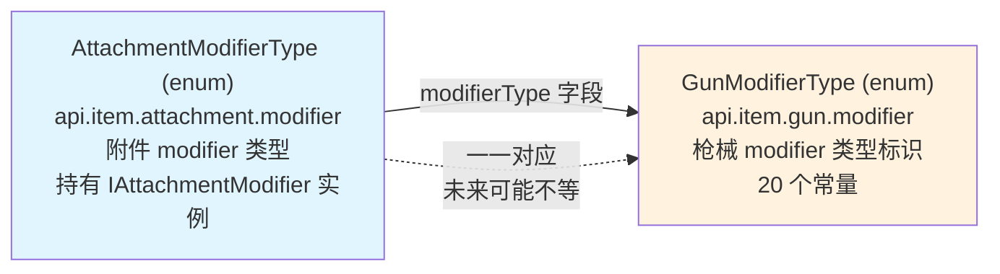

[English](#English)

# AttachmentModifierType 枚举

> CGC 用编译期类型安全的枚举替代运行时字符串键来标识和访问配件修改器。`AttachmentModifierType` 附属于 `GunModifierType`——每个附件 modifier 对应到一个枪械 modifier 类型。

### 与 GunModifierType 的关系



`AttachmentModifierType` 的每个常量对应一个 `GunModifierType`：
- `GunModifierType` 定义**枪械属性**的类型标识（typeName）
- `AttachmentModifierType` 继承该标识，并持有对应的 `IAttachmentModifier` 计算实例

### 接口层次

```
IItemModifier<T, K, V>                        无状态修饰工具
    ├── getModifier(T pojo) → K
    └── eval(Collection<K>, V base) → V
          ↑
IGunModifier<T, K, V>                         枪械修饰（声明 getBase）
    └── getBase(IGun, ItemStack, GunData) → V
          ↑
I*Modifier<T> (如 IAdsModifier)               getBase 的 default 实现
          ↑
IAttachmentModifier<K, V>                     配件修饰门面（T=AttachmentData）
          ↑
AttachmentModifier<K, V>                      抽象基类（evalSimpleModifierData）
          ↑
*Modifier (如 AdsModifier)                    具体类（getModifier + eval）
```

### IGunModifierType 接口

```java
public interface IGunModifierType {
    GunModifierType getGunModifierType();
}
```

`GunModifierType` 枚举和 `AttachmentModifierType` 枚举都实现了此接口。这使得：
- `GunModifierType.ADS.getGunModifierType()` → 返回自身
- `AttachmentModifierType.ADS.getGunModifierType()` → 返回 `GunModifierType.ADS`

未来如果出现非 attachment 来源的 gun modifier（如 ammo modifier），也可以实现 `IGunModifierType` 来声明它服务于哪个枪械属性。

# English
