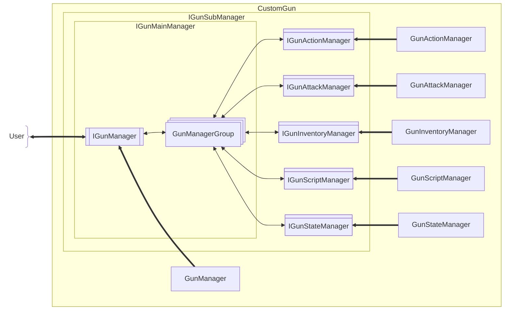

[English](#English)

# 枪械框架

枪械框架设计为**主管理器**调度各**子管理器**，将各功能拆分至子管理器：

|枪械子管理器|对应接口名称|职责简述|
|:--|:--|:--|
|枪械管理器（主管理器）|`IGunManager`|调度其他枪械子管理器|
|枪械动作管理器|`IGunActionManager`||
|枪械攻击管理器|`IGunAttackManager`||
|枪械背包管理器|`IGunInventoryManager`||
|枪械脚本管理器|`IGunScriptManager`|
|枪械状态管理器|`IGunStateManager`||

### 枪械子管理器
> 主管理器及子管理器都实现的接口

#### 枪械管理器组

主管理器可持有的子管理器的组合，以`managerGroupTag`标识
- 模组内置及默认组合的`managerGroupTag`为 "default"

## 枪械管理器
> 前往[枪械管理器](./gun-manager.md)

## 枪械动作管理器
> 前往[枪械操作管理器](./action/gun-action-manager.md)

## 枪械攻击管理器
> 前往[枪械攻击管理器](./attack/gun-attack-manager.md)

## 枪械背包管理器
> 前往[枪械背包管理器](./inventory/gun-inventory-manager.md)

## 枪械脚本管理器
> 前往[枪械脚本管理器](./script/gun-script-manager.md)

## 枪械状态管理器
> 前往[枪械状态管理器](./state/gun-state-manager.md)

# English

The gun framework is designed with a **Main Manager** orchestrating various **Sub-Managers**, splitting functionalities into distinct components:

|Gun Sub-Manager|Corresponding Interface|Responsibility Summary|
|:--|:--|:--|
|Gun Manager (Main)|`IGunManager`|Orchestrates other Gun Sub-Managers|
|Gun Action Manager|`IGunActionManager`||
|Gun Attack Manager|`IGunAttackManager`||
|Gun Inventory Manager|`IGunInventoryManager`||
|Gun Script Manager|`IGunScriptManager`|
|Gun State Manager|`IGunStateManager`||

### Gun Sub-Manager
> The common interface implemented by both the Main Manager and all Sub-Managers

#### Gun Manager Group

A combination of sub-managers that the Main Manager can hold, identified by `managerGroupTag`.
- The built-in and default combination's `managerGroupTag` is "default".

## Gun Manager
> Go to [Gun Manager](./gun-manager.md#English)

## Gun Action Manager
> Go to [Gun Action Manager](./action/gun-action-manager.md#English)

## Gun Attack Manager
> Go to [Gun Attack Manager](./attack/gun-attack-manager.md#English)

## Gun Inventory Manager
> Go to [Gun Inventory Manager](./inventory/gun-inventory-manager.md#English)

## Gun Script Manager
> Go to [Gun Script Manager](./script/gun-script-manager.md#English)

## Gun State Manager
> Go to [Gun State Manager](./state/gun-state-manager.md#English)
