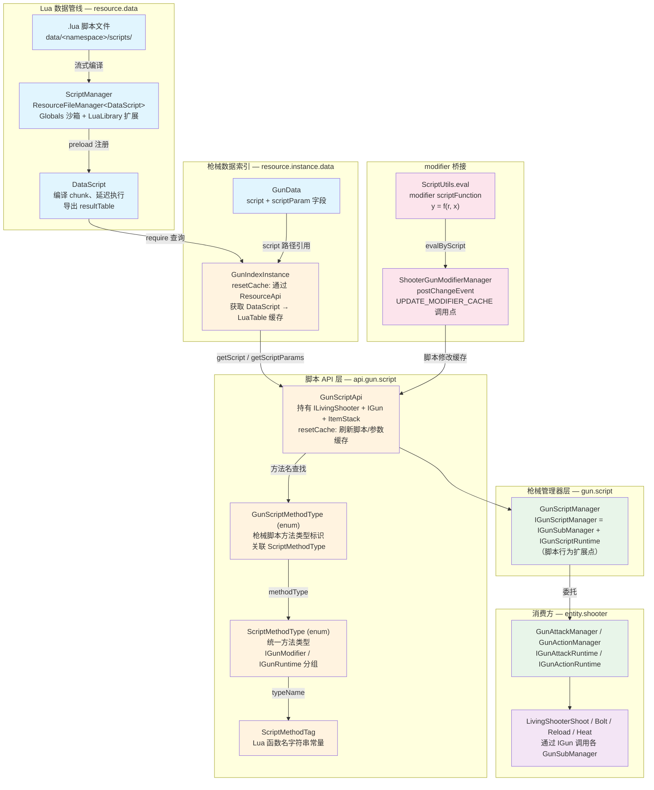
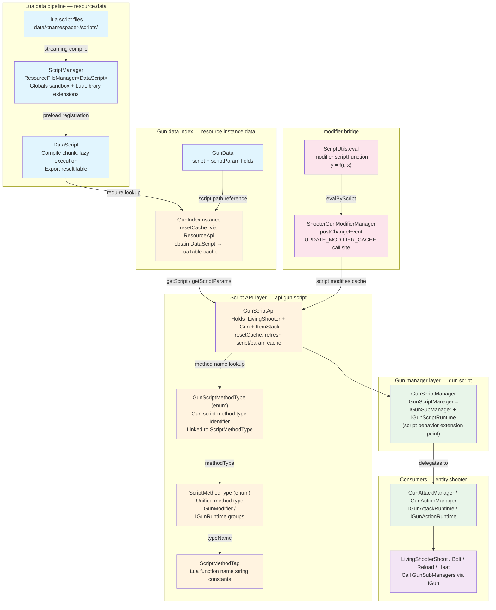

[English](#English)

# 枪械脚本框架

> 覆盖从`.lua`脚本文件加载到脚本被调用的完整链路，以及枪械行为脚本与 modifier 体系的桥接。

## 体系总览

## 两层脚本机制

本体系包含两个独立的脚本子体系，它们通过不同的路径作用于枪械属性：

|子体系|数据存储|脚本内容|消费方式|
|---|---|---|---|
|**枪械行为脚本**|`GunData.script` 引用的`.lua`文件|名为`start_bolt`/`shoot`/`tick_reload` 等的 Lua 函数，接收`GunScriptApi`|经由`GunScriptApi.simpleCall`/`getFunction`在`GunActionManager`/`GunAttackManager`/`GunStateManager`中调用脚本，脚本缺失时自动回退到`_DefaultGunAction`等默认实现|
|**modifier 表达式脚本**|`AttachmentData` JSON 中各 modifier 字段的`scriptFunction`|简单数学表达式 `y = f(r, x)`（`r`=原始值, `x`=当前值, `y`=结果）|`ScriptUtils.eval`，在 modifier 计算管线中逐 modifier 执行|

两者的交汇点：`ScriptMethodType.UPDATE_MODIFIER_CACHE`（对应 Lua 函数名 `update_modifier_cache`）允许枪械行为脚本在 modifier 缓存计算完成后对缓存值做最终修改，在`ShooterGunModifierManager.postChangeEvent`中调用。

## 三层职责划分

|层|包路径|职责|关键类|
|---|---|---|---|
|**数据管线层**|`resource.data`|`.lua` 文件加载、编译、沙箱执行|`ScriptManager`, `DataScript`|
|**API 层**|`api.gun.script`|脚本上下文封装、方法名类型标识|`GunScriptApi`, `GunScriptMethodType`, `ScriptMethodType`, `ScriptMethodTag`|
|**管理器层**|`gun.script`|脚本行为扩展点、`evalByScript`实现|`GunScriptManager`, `IGunScriptManager`, `IGunScriptRuntime`|

## 架构要点

- `ScriptManager`作为`ResourceFileManager<DataScript>`统一管理 Lua 文件生命周期，提供沙箱`Globals`（仅开放 safe libs）和`LuaLibrary`扩展机制
- `GunScriptApi`是脚本执行的上下文载体——持有`ILivingShooter`、`IGun`、`ItemStack`的引用，并缓存`LuaTable`脚本和参数
- 脚本中的函数名不再硬编码字符串：`ScriptMethodTag`定义常量，`ScriptMethodType`/`GunScriptMethodType`枚举管理类型标识，通过`IScriptMethodType`接口统一
- `IGunScriptRuntime`声明`evalByScript`方法，由`GunScriptManager`实现，负责在 modifier 缓存计算完成后由脚本对缓存值做最终修改。CGC 的设计意图是让枪械逻辑不再像 TaCZ `ModernKineticGunItem`那样大而全，而是将行为分散到`IGunAttackRuntime`/`IGunActionRuntime`/`IGunStateRuntime`等 sub-manager
- `GunScriptApi`新增`getFunction(ScriptMethodType)`和`simpleCall(ScriptMethodType)`两个辅助方法——`getFunction`从脚本缓存中按类型查找对应的 Lua 函数；`simpleCall`封装了函数调用、参数传递（以`GunScriptApi`自身为参数）和返回值解析（返回`TriBool.TRUE`/`FALSE`/`UNKNOWN`）的通用模式
- `GunActionManager`/`GunAttackManager`/`GunStateManager`中已落地脚本执行：通过`simpleCall`调用脚本；若脚本不存在或返回`UNKNOWN`则 fallback 到`_DefaultGunAction`/`_DefaultGunAttack`/`_DefaultGunState`的默认实现
- TaCZ `ModernKineticGunScriptAPI`中大而全的方法（`getReloadTime`/`adjustShootInterval`等）在 CGC 中由`ILivingShooter`及其组合接口提供，`GunScriptApi`仅做上下文聚合并提供`getFunction`/`simpleCall`作为调用 Lua 函数的便捷入口

## 文档导航

|文档|内容|
|---|---|
|[GunScriptManager](./gun-script-manager.md)|`IGunScriptManager`接口定义、`IGunScriptRuntime.evalByScript`、`GunScriptManager`实现|
|[脚本方法类型](./script-method-type.md)|`ScriptMethodType`/`GunScriptMethodType`/`ScriptMethodTag`：枚举替代硬编码字符串、两个分组的职责划分|
|[脚本数据管线](./script-data-pipeline.md)|`ScriptManager`→`DataScript`→`GunIndexInstance`→`GunScriptApi`的数据流转|
|[脚本与 modifier 关联](./script-and-modifier.md)|modifier `scriptFunction` 与枪械行为脚本的区别、`UPDATE_MODIFIER_CACHE` 桥接、类型安全差异|

# English

> Covers the complete chain from `.lua` script file loading to script invocation, including the bridge between gun behavior scripts and the modifier system.

## Architecture Overview

## Two Script Layers

This system contains two independent script sub-systems that affect gun properties through different paths:

|Sub-system|Data storage|Script content|Consumption|
|---|---|---|---|
|**Gun behavior scripts**|`.lua` files referenced by `GunData.script`|Lua functions named `start_bolt`/`shoot`/`tick_reload` etc., receiving `GunScriptApi`|Called via `GunScriptApi.simpleCall`/`getFunction` in `GunActionManager`/`GunAttackManager`/`GunStateManager`; falls back to `_DefaultGunAction` etc. when script is absent|
|**modifier expression scripts**|`scriptFunction` field in each modifier within `AttachmentData` JSON|Simple math expression `y = f(r, x)` (`r`=original value, `x`=current value, `y`=result)|`ScriptUtils.eval`, executed per modifier in the modifier computation pipeline|

The meeting point: `ScriptMethodType.UPDATE_MODIFIER_CACHE` (Lua function name `update_modifier_cache`) allows gun behavior scripts to make final modifications to cached values after modifier computation, called within `ShooterGunModifierManager.postChangeEvent`.

## Three-Layer Responsibility Division

|Layer|Package path|Responsibility|Key types|
|---|---|---|---|
|**Data pipeline layer**|`resource.data`|`.lua` file loading, compilation, sandbox execution|`ScriptManager`, `DataScript`|
|**API layer**|`api.gun.script`|Script context encapsulation, method name type identification|`GunScriptApi`, `GunScriptMethodType`, `ScriptMethodType`, `ScriptMethodTag`|
|**Manager layer**|`gun.script`|Script behavior extension point, `evalByScript` implementation|`GunScriptManager`, `IGunScriptManager`, `IGunScriptRuntime`|

## Architecture Points

- `ScriptManager` manages Lua file lifecycle as `ResourceFileManager<DataScript>`, providing a sandboxed `Globals` (only safe libs exposed) and a `LuaLibrary` extension mechanism
- `GunScriptApi` is the script execution context carrier — holds references to `ILivingShooter`, `IGun`, and `ItemStack`, and caches `LuaTable` script and parameters
- Function names in scripts are no longer hardcoded strings: `ScriptMethodTag` defines constants, `ScriptMethodType`/`GunScriptMethodType` enums manage type identification, unified through the `IScriptMethodType` interface
- `IGunScriptRuntime` declares the `evalByScript` method, implemented by `GunScriptManager`, responsible for allowing scripts to make final modifications to cached values after modifier cache computation. The design intent is to avoid the monolithic `ModernKineticGunItem` approach, distributing behavior across `IGunAttackRuntime`/`IGunActionRuntime`/`IGunStateRuntime` and other sub-managers
- `GunScriptApi` adds two helper methods: `getFunction(ScriptMethodType)` and `simpleCall(ScriptMethodType)` — `getFunction` looks up the corresponding Lua function from the script cache by type; `simpleCall` encapsulates the common pattern of function invocation, parameter passing (with `GunScriptApi` itself as argument), and return value resolution (returning `TriBool.TRUE`/`FALSE`/`UNKNOWN`)
- Script execution has landed in `GunActionManager`/`GunAttackManager`/`GunStateManager`: scripts are invoked via `simpleCall`; when the script is absent or returns `UNKNOWN`, execution falls back to the default implementations in `_DefaultGunAction`/`_DefaultGunAttack`/`_DefaultGunState`
- The many methods in TaCZ's `ModernKineticGunScriptAPI` (`getReloadTime`/`adjustShootInterval` etc.) are provided by `ILivingShooter` and its composed interfaces in CGC; `GunScriptApi` is purely a context aggregator that also provides `getFunction`/`simpleCall` as convenient entry points for calling Lua functions

## Document Navigation

|Document|Content|
|---|---|
|[GunScriptManager](./gun-script-manager.md)|`IGunScriptManager` interface definition, `IGunScriptRuntime.evalByScript`, `GunScriptManager` implementation|
|[Script Method Types](./script-method-type.md)|`ScriptMethodType`/`GunScriptMethodType`/`ScriptMethodTag`: enums replacing hardcoded strings, two-group responsibility split|
|[Script Data Pipeline](./script-data-pipeline.md)|Data flow: `ScriptManager`→`DataScript`→`GunIndexInstance`→`GunScriptApi`|
|[Script and Modifier](./script-and-modifier.md)|Differences between modifier `scriptFunction` and gun behavior scripts, `UPDATE_MODIFIER_CACHE` bridge, type safety strategies|
