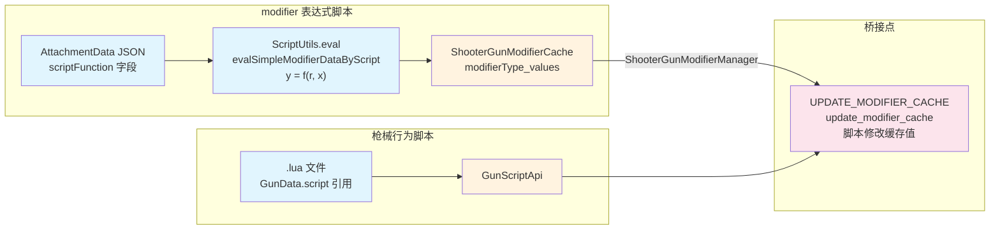
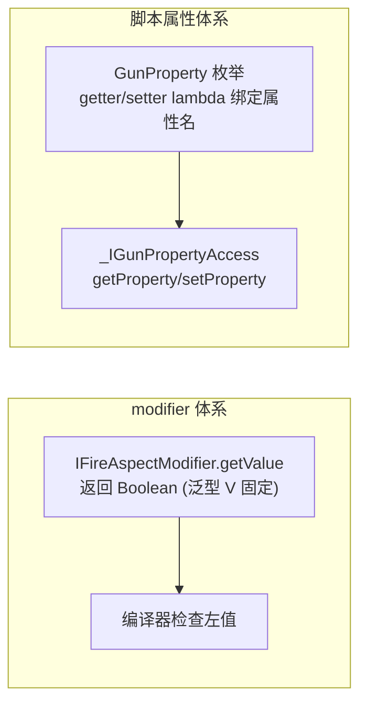
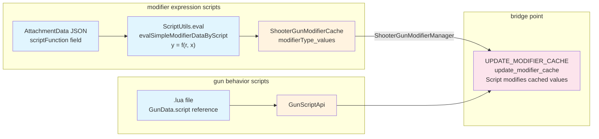
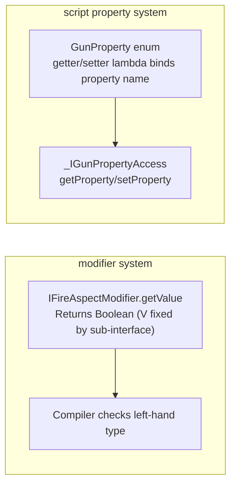

[English](#English)

# 脚本与 modifier 关联

> 枪械行为脚本与 modifier 体系的交汇点：`scriptFunction`表达式、`UPDATE_MODIFIER_CACHE`桥接，以及两种体系在类型安全策略上的差异。

## 两条独立的脚本链路

## modifier scriptFunction

[modifier 计算流程](/docs/architecture/core/entity/shooter/modifier/calculation-flow.md)的最后一步是在每个 modifier 上执行可选的`scriptFunction`。这是一段简单的 Lua 数学表达式（如 `y = r * x + 0.5`），通过`ScriptUtils.eval`执行：
- `r`（base）：属性原始值
- `x`（value）：modifier 计算后的当前值
- `y`：表达式执行结果，覆盖 x 的值

`IGunModifier.evalSimpleModifierDataByScript`是`evalByScript`的默认实现，Float 型 modifier 子接口通过`default evalByScript`委托到它。与 TaCZ 原版`AttachmentPropertyManager.functionEval`相比，CGC 改用`ThreadLocal<ScriptEngine>`保证线程隔离。

## UPDATE_MODIFIER_CACHE 桥接

TaCZ 原版 `AttachmentPropertyManager.postChangeEvent` 在 modifier 缓存计算完成后，遍历所有标记了`@CacheModifiableByScript`的属性，对每个属性调用`iGun.modifyProperty(..., "modify_cached_property", ...)`。这个方法会在枪械行为脚本中查找名为`modify_cached_property`（在 CGC 中：`update_modifier_cache`）的 Lua 函数，以脚本 API 和属性 ID/值为参数调用。

这是枪械行为脚本与 modifier 体系的**唯一桥接点**——它让脚本能在配件 modifier 计算完成后对缓存值做二次修改。

CGC 中该逻辑在`ShooterGunModifierManager.postChangeEvent`中尚未完成移植。对应的`ScriptMethodType`标识为`UPDATE_MODIFIER_CACHE`，属于`IGunModifier`分组。

## 类型安全：两种策略

modifier 体系与脚本体系在处理值的类型安全时采用了不同策略，两种方式已完整移植到 CGC：

### modifier 体系：接口泛型 + 编译器检查

通过`I*Modifier`子接口的`static getValue`方法签名的泛型返回类型`V`，编译器可验证左值类型。详见[枚举类型设计](/docs/architecture/core/entity/shooter/modifier/modifier-type.md)。

调用方式：`var armorIgnore = IArmorIgnoreModifier.getValue(cache, AttachmentModifierType.ARMOR_IGNORE_PERCENT);`——编译器从返回值推断`armorIgnore`的类型为`Float`。

### 脚本属性体系：枚举 getter/setter

TaCZ 原版`GunProperties`使用`GunProperty<T>`的`Class<T>`参数显式指定类型（如`GunProperty.of("ads", Float.class)`），调用时需要手动传`Class`类型和强制转换。

CGC 将枪械属性改为`GunProperty`枚举——每个常量同时持有`propertyName`、getter lambda（`BiFunction<IGunDataAccess, ItemStack, ?>`）和 setter lambda（`TriConsumer<...>`）。通过`_IGunPropertyAccess`接口对外暴露 get/set。类似地，`GunProjectileProperty`枚举通过`_IGunProjectilePropertyAccess`对外暴露。

两种策略的分工：
- modifier 体系：用于配件对枪械属性的修改，由 Java 代码直接调用 → 接口泛型保证编译期检查
- 脚本属性体系：用于外部脚本引擎（KubeJS 等）通过字符串键访问属性 → 枚举的 getter/setter lambda 携带类型信息，避免`Class`参数传递

# English

> The intersection point of gun behavior scripts and the modifier system: `scriptFunction` expressions, the `UPDATE_MODIFIER_CACHE` bridge, and the differences in type safety strategies between the two systems.

## Two Independent Script Chains

## modifier scriptFunction

The final step of the [modifier calculation flow](/docs/architecture/core/entity/shooter/modifier/calculation-flow.md) executes an optional `scriptFunction` on each modifier. This is a simple Lua math expression (e.g. `y = r * x + 0.5`), executed via `ScriptUtils.eval`:
- `r` (base): the property's original value
- `x` (value): the current value after modifier computation
- `y`: the expression's execution result, overwriting x

`IGunModifier.evalSimpleModifierDataByScript` is the default implementation for `evalByScript`. Float-type modifier sub-interfaces delegate to it through `default evalByScript`. Compared to the original TaCZ `AttachmentPropertyManager.functionEval`, CGC uses `ThreadLocal<ScriptEngine>` for thread isolation.

## UPDATE_MODIFIER_CACHE Bridge

The original TaCZ `AttachmentPropertyManager.postChangeEvent`, after modifier cache computation completes, iterates over all properties annotated with `@CacheModifiableByScript` and calls `iGun.modifyProperty(..., "modify_cached_property", ...)` for each. This method looks up the Lua function named `modify_cached_property` (in CGC: `update_modifier_cache`) in the gun behavior script, calling it with the script API and property id/value as parameters.

This is the **only bridge point** between gun behavior scripts and the modifier system — it allows scripts to make secondary modifications to cached values after attachment modifier computation completes.

In CGC, this logic has not yet been ported in `ShooterGunModifierManager.postChangeEvent`. The corresponding `ScriptMethodType` identifier is `UPDATE_MODIFIER_CACHE`, belonging to the `IGunModifier` group.

## Type Safety: Two Strategies

The modifier system and the script system use different strategies for value type safety. Both have been fully ported to CGC:

### modifier system: interface generics + compiler checks

Through the generic return type `V` in the `static getValue` method signature of `I*Modifier` sub-interfaces, the compiler can verify the left-hand value type. See [Enum Type Design](/docs/architecture/core/entity/shooter/modifier/modifier-type.md).

Call pattern: `var armorIgnore = IArmorIgnoreModifier.getValue(cache, AttachmentModifierType.ARMOR_IGNORE_PERCENT);` — the compiler infers `armorIgnore`'s type as `Float` from the return value.

### script property system: enum getter/setter

The original TaCZ `GunProperties` uses `GunProperty<T>`'s `Class<T>` parameter to explicitly specify types (e.g. `GunProperty.of("ads", Float.class)`), requiring manual `Class` type passing and casting at call sites.

CGC replaces gun properties with the `GunProperty` enum — each constant holds `propertyName`, a getter lambda (`BiFunction<IGunDataAccess, ItemStack, ?>`) and a setter lambda (`TriConsumer<...>`). Access is exposed through the `_IGunPropertyAccess` interface. Similarly, the `GunProjectileProperty` enum is exposed through `_IGunProjectilePropertyAccess`.

Division of labor between the two strategies:
- modifier system: used for attachment-to-gun-property modifications, called directly from Java code → interface generics guarantee compile-time checking
- script property system: used for external script engines (KubeJS etc.) to access properties by string key → enum getter/setter lambdas carry type information, avoiding `Class` parameter passing
