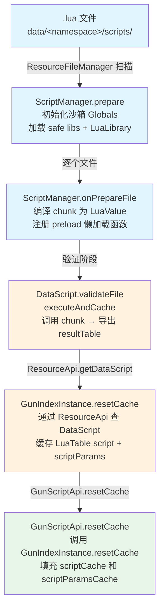
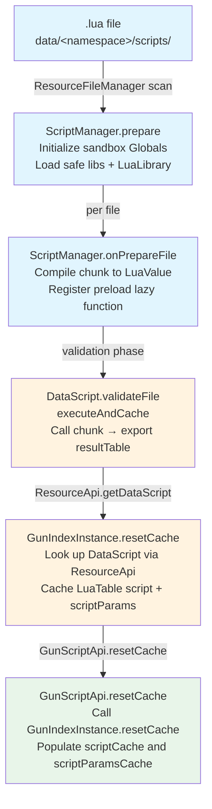

[English](#English)

# 脚本数据管线

> `.lua`脚本文件从加载到编译、缓存、供`GunScriptApi`消费的完整数据流转。

## 管线流程

## ScriptManager：沙箱与资源管理

`ScriptManager`继承`ResourceFileManager<DataScript>`，统一管理 Lua 脚本的资源加载生命周期。

沙箱环境只加载安全的 lua 标准库：
- `JseBaseLib`（基础类型与函数）
- `PackageLib`（`require` 机制，工作目录锁定）
- `Bit32Lib`（位运算）
- `TableLib`（表操作）
- `JseStringLib`（字符串操作）
- `JseMathLib`（数学函数）
- **不加载**：`CoroutineLib`、`JseIoLib`、`JseOsLib`、`LuajavaLib`

`LuaLibrary`接口提供沙箱扩展点。内置扩展`LuaGunLogicLib`向 Lua 全局环境注入枚举常量（`ReloadState.StateType`的序数映射、`FireModeType`的序数映射）。

### preload 机制

每个`.lua`文件的 chunk 不立即执行。在`onPrepareFile`阶段，将文件编译为`LuaValue chunk`并以模块名注册到`package.preload`。当脚本通过`require()`引用其他脚本时，Luaj 才通过包装的`Supplier`惰性调用并缓存结果。

模块名规则：`{namespace}_{path}`，如 `tacz_scripts/my_gun`。

## DataScript：编译与执行

`DataScript`是`ResourceFile`的 Lua 脚本实现：
- 编译时（`fromInputStream`）：调用`Globals.load(reader, chunkDebugName)`流式词法分析编译为 chunk，不执行
- 验证时（`validateFile`）：调用`executeAndCache()`触发执行，获取`resultTable`（Lua 文件顶层`return`的 table）
- 不支持序列化：Lua chunk 编译后不可逆转为源码

`executeAndCache()`仅在`resultTable`为 null 时执行，保证懒加载且不重复执行。

## GunIndexInstance 缓存

`GunIndexInstance.resetCache()`中：
1. 从`GunData.getScriptLocation()`获取脚本文件路径
2. 通过`ResourceApi.getDataScript(scriptLocation)`查询对应的`DataScript`
3. 校验其有效性后取出`getResultTable()`作为`scriptCache`
4. 从`GunData.getScriptParam()`获取参数 Map，转换为`LuaTable`作为`scriptParamCache`

脚本文件不存在或无效不影响枪械数据整体加载（该字段可选）。

## GunScriptApi 消费

`GunScriptApi.resetCache()`是调用方入口：
1. 从`IGun.getGunLocation(gunItem)`获取 gunId
2. `ResourceApi.getGunIndexInstance(gunId)`获取`GunIndexInstance`
3. 调用`gunIndexInstance.resetCache()`刷新内部缓存
4. 从缓存中取`script`和`scriptParams`填充到自身字段

返回`false`时表示缓存不可用（gun 数据不存在或脚本缺失）。调用方（如`_GunProjectileConstructor.applyScriptModification`）据此决定是否执行脚本修改逻辑。

# English

> The complete data flow of `.lua` script files from loading through compilation and caching to consumption by `GunScriptApi`.

## Pipeline Flow

## ScriptManager: Sandbox and Resource Management

`ScriptManager` extends `ResourceFileManager<DataScript>`, managing the Lua script resource loading lifecycle.

The sandbox environment only loads safe lua standard libraries:
- `JseBaseLib` (basic types and functions)
- `PackageLib` (`require` mechanism, working directory locked)
- `Bit32Lib` (bitwise operations)
- `TableLib` (table manipulation)
- `JseStringLib` (string operations)
- `JseMathLib` (math functions)
- **Not loaded**: `CoroutineLib`, `JseIoLib`, `JseOsLib`, `LuajavaLib`

The `LuaLibrary` interface provides a sandbox extension point. The built-in extension `LuaGunLogicLib` injects enum constants into the Lua global environment (ordinal mappings for `ReloadState.StateType` and `FireModeType`).

### preload mechanism

Each `.lua` file's chunk is not executed immediately. During `onPrepareFile`, the file is compiled into a `LuaValue chunk` and registered with the module name in `package.preload`. When a script references another script via `require()`, Luaj lazily calls the wrapped `Supplier` and caches the result.

Module name rule: `{namespace}_{path}`, e.g. `tacz_scripts/my_gun`.

## DataScript: Compilation and Execution

`DataScript` is the Lua script implementation of `ResourceFile`:
- Compile time (`fromInputStream`): Calls `Globals.load(reader, chunkDebugName)` for streaming lexical analysis compilation into a chunk, without execution
- Validation time (`validateFile`): Calls `executeAndCache()` to trigger execution, obtaining `resultTable` (the table returned by the Lua file's top-level `return`)
- Serialization not supported: Lua chunks cannot be reversed back to source after compilation

`executeAndCache()` only executes when `resultTable` is null, ensuring lazy loading and no duplicate execution.

## GunIndexInstance Cache

Within `GunIndexInstance.resetCache()`:
1. Obtain the script file path from `GunData.getScriptLocation()`
2. Look up the corresponding `DataScript` via `ResourceApi.getDataScript(scriptLocation)`
3. After validating it, take `getResultTable()` as `scriptCache`
4. Get the parameter map from `GunData.getScriptParam()` and convert to `LuaTable` as `scriptParamCache`

A missing or invalid script file does not affect the overall gun data load (the field is optional).

## GunScriptApi Consumption

`GunScriptApi.resetCache()` is the caller entry point:
1. Obtain gunId from `IGun.getGunLocation(gunItem)`
2. Get `GunIndexInstance` via `ResourceApi.getGunIndexInstance(gunId)`
3. Call `gunIndexInstance.resetCache()` to refresh internal caches
4. Take `script` and `scriptParams` from the cache and populate its own fields

Returns `false` when the cache is unavailable (gun data not found or script missing). Callers (e.g. `_GunProjectileConstructor.applyScriptModification`) use this to decide whether to execute script modification logic.
