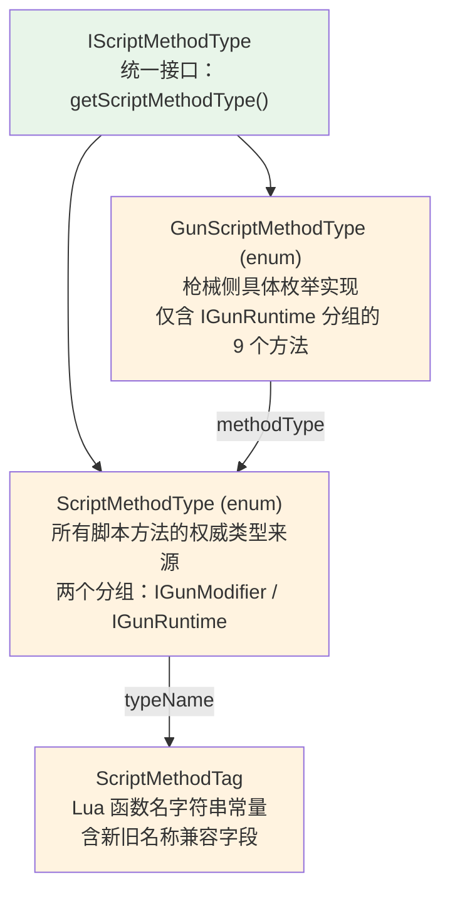
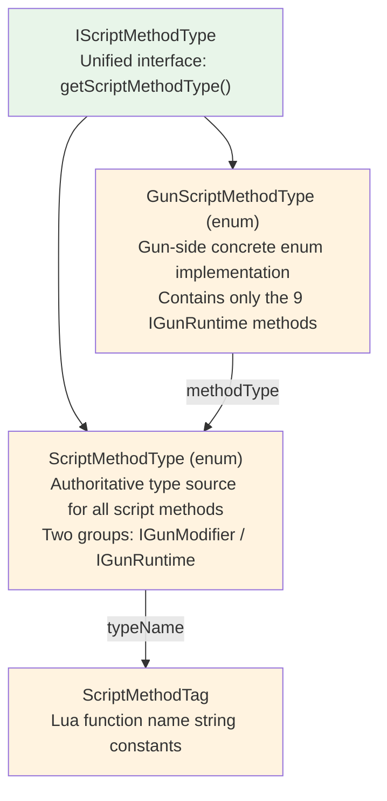

[English](#English)

# 脚本方法类型

> CGC 用编译期类型安全的枚举替代运行时字符串键来标识和查找枪械脚本的 Lua 函数。

## 类型层级

## 两个分组

`ScriptMethodType`枚举按职责分为两组，由`GunScriptMethodType`枚举筛选枪械侧的调用点：

|分组|方法|Lua 函数名|含义|
|---|---|---|---|
|`IGunModifier`|`UPDATE_MODIFIER_CACHE`|`update_modifier_cache`|modifier 缓存计算完成后，脚本可对缓存值做最终修改|
|`IGunRuntime`|`START_BOLT`|`start_bolt`|开始拉栓，返回是否成功|
||`TICK_BOLT`|`tick_bolt`|拉栓 tick，返回是否仍在拉栓|
||`SHOOT`|`shoot`|执行射击逻辑（替代默认射击流程）|
||`START_RELOAD`|`start_reload`|开始换弹，返回是否成功|
||`TICK_RELOAD`|`tick_reload`|换弹 tick，返回换弹状态|
||`INTERRUPT_RELOAD`|`interrupt_reload`|打断换弹|
||`TICK_HEAT`|`tick_heat`|过热 tick 处理|
||`CALCULATE_SPREAD`|`calculate_spread`|计算子弹散布，返回 `{pitch, yaw}` 表|
||`HANDLE_SHOOT_HEAT`|`handle_shoot_heat`|射击时过热处理|

`GunScriptMethodType`仅包含`IGunRuntime`分组的 9 个方法，每个常量持有对应的`ScriptMethodType`引用。

## 枚举设计要点

- `ScriptMethodTag`是函数名字符串的**唯一常量来源**——不分散在各调用处硬编码
- 每个`ScriptMethodType`枚举常量通过`IScriptMethodType.getScriptMethodType()`自引用
- `GunScriptMethodType`枚举常量转发`methodType`字段到对应的`ScriptMethodType`
- 从字符串查找时，所有枚举均维护静态`Map<String, ?>`查找表

## 与 TaCZ 的差异

|维度|TaCZ|CGC|
|---|---|---|
|Lua 函数名字符串|散落在`ModernKineticGunItem`各处硬编码|集中在`ScriptMethodTag`常量类|
|方法类型标识|无|`ScriptMethodType`枚举（双分组）+`GunScriptMethodType`枚举（枪械筛选）|
|扩展方式|添加新函数名需修改各处字符串|新增`ScriptMethodType`常量 + 在`ScriptMethodTag`添加标签即可|

# English

> CGC replaces runtime string keys with compile-time type-safe enums to identify and look up Lua functions in gun scripts.

## Type Hierarchy

## Two Groups

`ScriptMethodType` is divided into two groups by responsibility. `GunScriptMethodType` filters to the gun-side call sites:

|Group|Method|Lua function name|Meaning|
|---|---|---|---|
|`IGunModifier`|`UPDATE_MODIFIER_CACHE`|`update_modifier_cache`|After modifier cache computation, script can make final modifications to cached values|
|`IGunRuntime`|`START_BOLT`|`start_bolt`|Start bolt, returns success|
||`TICK_BOLT`|`tick_bolt`|Bolt tick, returns whether still bolting|
||`SHOOT`|`shoot`|Execute shoot logic (replaces default shoot flow)|
||`START_RELOAD`|`start_reload`|Start reload, returns success|
||`TICK_RELOAD`|`tick_reload`|Reload tick, returns reload state|
||`INTERRUPT_RELOAD`|`interrupt_reload`|Interrupt reload|
||`TICK_HEAT`|`tick_heat`|Heat tick handling|
||`CALCULATE_SPREAD`|`calculate_spread`|Calculate bullet spread, returns `{pitch, yaw}` table|
||`HANDLE_SHOOT_HEAT`|`handle_shoot_heat`|Heat handling at shoot time|

`GunScriptMethodType` contains only the 9 methods from the `IGunRuntime` group, each constant holding the corresponding `ScriptMethodType` reference.

## Enum Design Points

- `ScriptMethodTag` is the **single source of truth** for function name strings — not scattered as hardcoded literals at call sites
- Each `ScriptMethodType` enum constant self-references via `IScriptMethodType.getScriptMethodType()`
- `GunScriptMethodType` enum constants forward their `methodType` field to the corresponding `ScriptMethodType`
- For string lookup, all enums maintain static `Map<String, ?>` lookup tables

## Differences from TaCZ

|Dimension|TaCZ|CGC|
|---|---|---|
|Lua function name strings|Hardcoded throughout `ModernKineticGunItem`|Centralized in `ScriptMethodTag` constant class|
|Method type identification|None|`ScriptMethodType` enum (two groups) + `GunScriptMethodType` enum (gun-side filter)|
|Extension method|Adding a function name requires changing strings everywhere|Add a `ScriptMethodType` constant + a tag in `ScriptMethodTag`|
