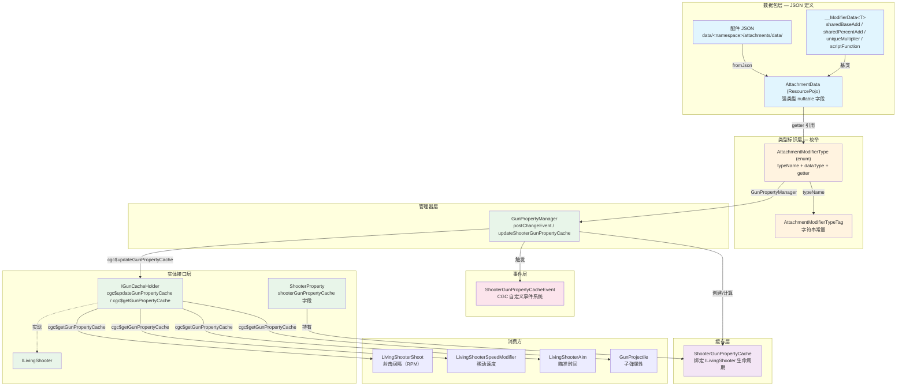

# CGC 配件属性修改器体系

> CGC 对 TaCZ 配件属性修改器体系的重构版本。覆盖从 JSON 数据定义 → 强类型枚举 → 缓存管道 → 事件系统 → 消费方的完整链路。

## 体系总览



## 重构设计哲学

CGC 对 TaCZ 原版体系的重构围绕以下核心原则：

### 1. 枚举替代字符串（类型安全）

| 维度 | TaCZ（原版） | CGC（重构） |
|---|---|---|
| Modifier 标识 | `String` ID（如 `"ads"`, `"damage"`） | `AttachmentModifierType` 枚举常量 |
| JSON 字段名 | 散落在各 Modifier 的 `@SerializedName` | 集中在 `AttachmentModifierTypeTag` 常量类 |
| AttachmentData 修改器存储 | `Map<String, JsonProperty<?>>` | 强类型 nullable 字段，每个枚举有一个 getter |
| 从 AttachmentData 取值 | `data.getModifier().get(id).getValue()` + 强制转换 | `type.get(data, _SimpleModifierData.class)` + 编译期类型检查 |

**优势**：
- 编译期保证不会出现拼写错误的 modifier ID
- IDE 可以追踪所有 modifier 的引用
- 修改器列表不再分散在多个类的 `registerModifier()` 中

### 2. 接口替代枚举常量（可扩展性）

`AttachmentModifierType` 枚举中有一条 TODO（第 74 行）：

```java
// TODO ? 构造函数参数改成接口类，接口类负责定义泛型、getter/setter、::new
```

**当前状态**：枚举持有 `dataType`（`Class<?>`）、`getter`（`Function<AttachmentData, ?>`），以字段的方式定义每个类型的元数据。

**计划方向**：将这些元数据抽象为接口 `ModifierDataType<T>`，该接口定义：
- `Class<T> getDataType()` — 数据值类型
- `T getFrom(AttachmentData data)` — 从 AttachmentData 读取
- `T createInstance()` — 工厂方法

这样可以在不改枚举的前提下通过接口扩展新的 modifier 类型。

### 3. 语义化重命名

| TaCZ 名称 | CGC 名称 | 含义变更 |
|---|---|---|
| `AttachmentCacheProperty` | `ShooterGunPropertyCache` | 明确此缓存**绑在 ILivingShooter 生命周期**，避免与配件数据混淆 |
| `AttachmentPropertyManager` | `GunPropertyManager` | 强调的是**枪械属性**的管理，不只是配件属性 |
| `ShooterDataHolder` | `ShooterProperty` | 精简名称，突出是属性集合 |
| `IGunOperator` | `ILivingShooter` | 语义更精确：接口描述的是**射手实体**而非操作者行为 |
| `AttachmentPropertyEvent` | `ShooterGunPropertyCacheEvent` | 事件描述的是**缓存更新**这个动作 |
| `addend` / `percent` / `multiplier` | `sharedBaseAdd` / `sharedPercentAdd` / `uniqueMultiplier` | 明确语义：哪些是共享加成、哪些是唯一乘数 |

### 4. 项目基础设施整合

- **JSON 序列化**：使用项目 `ResourcePojo<T>` 框架（而非直接 Gson），统一资源管理的验证和向后兼容逻辑
- **事件系统**：使用 CGC 的 `CustomEventType` + `EventDispatcher` 体系（而非 Forge 事件总线）
- **网络消息**：使用 `SendUtils` 统一发送入口
- **NBT 操作**：使用 `NBTUtils` 封装

## 文档导航

| 文档 | 内容 |
|---|---|
| [JSON 数据结构](./data-structure.md) | `__ModifierData<T>` 基类与子类，`AttachmentData` 强类型字段设计，JSON 标签常量体系 |
| [AttachmentModifierType 枚举](./modifier-type.md) | 枚举设计、typeName/dataType/getter 三元组、与 TaCZ 字符串键体系的对比 |
| [缓存系统](./cache-system.md) | `ShooterGunPropertyCache` 生命周期、`GunPropertyManager` 管线、`IGunCacheHolder` 接口 |
| [事件与通知](./event-and-notification.md) | `ShooterGunPropertyCacheEvent` 事件设计、自定义事件派发流 |
| [消费方汇总](./consumer-sites.md) | 所有 `cgc$getGunPropertyCache()` 调用位置、消费模式、当前 TODO 状态 |
| [迁移对照](./migration-mapping.md) | TaCZ → CGC 逐类迁移映射与兼容说明 |
