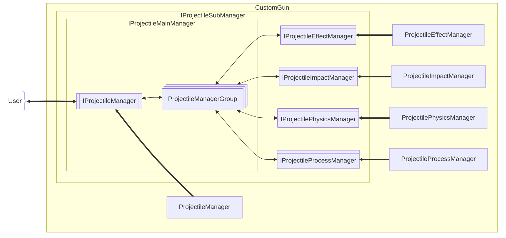

[English](#English)

# 枪射物框架

枪射物框架设计为**主管理器**调度各**子管理器**，将各功能拆分至子管理器：

|枪射物子管理器|对应接口名称|职责简述|
|:--|:--|:--|
|枪射物管理器（主管理器）|`IProjectileManager`|持有[枪射物管理器组](#枪射物管理器组)|
|枪射物效果管理器|`IProjectileEffectManager`|生成视觉/炫技效果|
|枪射物作用管理器|`IProjectileImpactManager`|处理枪射物与对象相互作用造成的影响（实际出伤/触发机制）|
|枪射物物理管理器|`IProjectilePhysicsManager`|计算物理状态|
|枪射物进程管理器|`IProjectileProcessManager`|调度各子管理器|

### 枪射物子管理器
> 🤔深度定制枪射物：[注册枪射物管理器组](./register-projectile-manager-group.md)

主管理器及子管理器都实现的接口

#### 枪射物管理器组

主管理器可持有的子管理器的组合，以`managerGroupTag`标识
- 模组内置及默认组合的`managerGroupTag`为 "default"

## 枪射物管理器
> 前往[枪射物管理器](./projectile-manager.md)

## 枪射物效果管理器
> 前往[枪射物效果管理器](./effect/projectile-effect-manager.md)

## 枪射物作用管理器
> 前往[枪射物作用管理器](./impact/projectile-impact-manager.md)

## 枪射物物理管理器
> 前往[枪射物物理管理器](./physics/projectile-physics-manager.md)

## 枪射物进程管理器
> 前往[枪射物进程管理器](./process/projectile-process-manager.md)

# English

The projectile framework is designed with a **Main Manager** orchestrating various **Sub-Managers**, splitting functionalities into distinct components:

|Projectile Sub-Manager|Corresponding Interface|Responsibility Summary|
|:--|:--|:--|
|Projectile Manager (Main)|`IProjectileManager`|Holds the [Gun Projectile Manager Group](#Gun%20Projectile%20Manager%20Group)|
|Projectile Effect Manager|`IProjectileEffectManager`|Generates visual/flair effects|
|Projectile Impact Manager|`IProjectileImpactManager`|Handles effects caused by interactions between projectiles and targets (actual damage/trigger logic)|
|Projectile Physics Manager|`IProjectilePhysicsManager`|Calculates physical states|
|Projectile Process Manager|`IProjectileProcessManager`|Orchestrates other sub-managers|

### Projectile Sub-Manager
> 🤔Deeply customized gun projectile: [Register ProjectileManagerGroup](./register-projectile-manager-group.md#English)

The common interface implemented by both the Main Manager and all Sub-Managers

#### Gun Projectile Manager Group

A combination of sub-managers that the Main Manager can hold, identified by `managerGroupTag`.
- The built-in and default combination's `managerGroupTag` is "default".

## Gun Projectile Manager
> Go to [Gun Projectile Manager](./projectile-manager.md#English)

## Gun Projectile Effect Manager
> Go to [Gun Projectile Effect Manager](./effect/projectile-effect-manager.md#English)

## Gun Projectile Impact Manager
> Go to [Gun Projectile Impact Manager](./impact/projectile-impact-manager.md#English)

## Gun Projectile Physics Manager
> Go to [Gun Projectile Physics Manager](./physics/projectile-physics-manager.md#English)

## Gun Projectile Process Manager
> Go to [Gun Projectile Process Manager](./process/projectile-process-manager.md#English)
