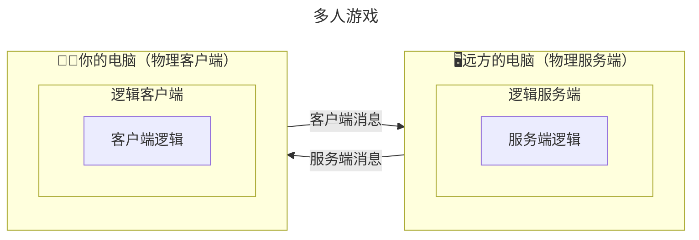
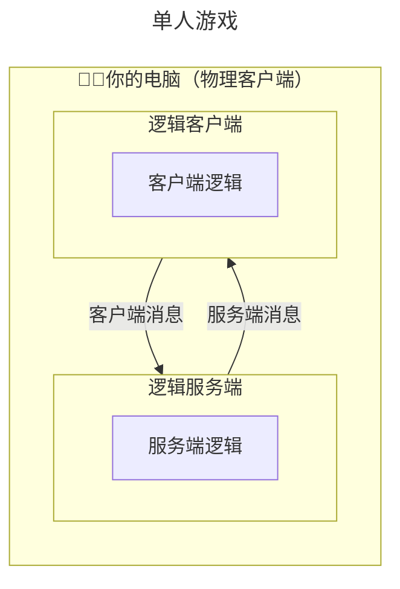
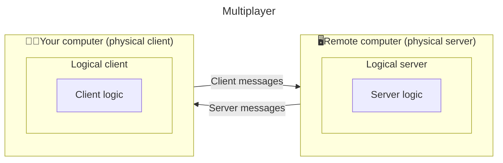
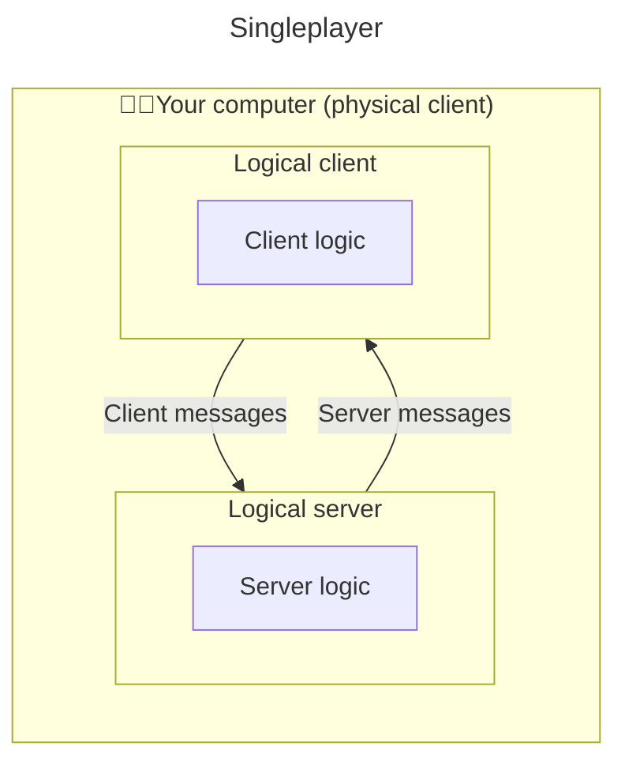

[English](#English)

# 常见机制
> wiki 版本：`0.0.8`.1

模组开发需要了解和经常用到的机制。

## 模组入门

### 模组入口

一个模组要运行起来，首先得有一个“模组主类”：
- 从 _./src/main/java/_ 开始往下找，当你看到一个**和模组名字很像的 Java 类**，同时旁边还有其他子文件夹时，通常就是它了
- 对于 Forge/NeoForge 模组，只要在文件里看到`@Mod`注解，就说明找对了✅

模组刚加载时要跑的代码，都会放在这里。

### 注册机制

开发模组的第一步，就是**把东西添加到游戏里，通常需要注册**。

不用担心不知道怎么写注册，你可以[学习社区的积累](https://github.com/XColorful/Custom-Gun-Continued/wiki/Learn-from-the-community)：
- 注册相关代码一般都放在 _./init_ 包下或模组主类里
- 找到注册入口后，继续顺着看它的调用链路
- 当你学会一两种东西是怎么注册的之后，便能逐渐摸清门道，轻车熟路
- 另外，也可以单独搜索“如何注册xxx”的手把手教学视频

> 请牢记，你不是一个人；**当你需要了解某个内容时，开源社区拥有丰富的代码积累**。

当遇到困难时，可以[向AI求助](https://github.com/XColorful/Custom-Gun-Continued/wiki/Ask-AI-for-help)以下问题：
- 这种注册类别是否还要去 _./src/main/resources_ 补充相关内容？
- 如果模组注册了多种东西，它们的注册顺序有讲究吗？
- 是否需要在模组平台（如 Forge/NeoForge）提供的注册事件里去注册？
- 注册的内容是否需要手动执行某种初始化逻辑？
- 尝试添加日志来验证注册是否生效？

### 🧑‍💻客户端与服务端🖥️

当你游玩“多人游戏”时，有一台是你正在用的电脑，还有一台远方的服务器：
- 你面前的电脑为`物理客户端`，执行**仅客户端逻辑**
- 远方的服务为`物理服务端`，执行**仅服务端逻辑**
- 两台电脑都执行的逻辑，即双端逻辑

当你玩“单人游戏”时，虽然物理上是同一台电脑，Minecraft 仍然会区分成两个角色来运行：
- 处理客户端逻辑时，它扮演`逻辑客户端`
- 处理服务端逻辑时，它扮演`逻辑服务端`

写模组代码时，需要注意：
- 当前处于`逻辑客户端`还是`逻辑服务端`，是**由 Minecraft 运行机制决定，而不是自己随意能改的**
- 在“单人游戏”可能会忽略客户端与服务端之间的通信问题，所以需要“多人游戏”下也测试一遍
- 通常，纯客户端逻辑放在 _./client/_ 包下，并且需要确保只在`逻辑客户端`执行
> ⚠️ 注意：如果在服务端上运行了客户端逻辑，很可能会导致崩溃

### 💉注入机制
> （可跳过！）该内容不易理解，初次阅读可以跳过😀

有的时候需要往原版逻辑里添加一段内容，通常需要使用 _Mixin_ 来完成“注入”：
- _Mixin_ 可以实现注入逻辑、修改返回值等操作
- 用好 _Mixin_，可以实现更广泛的功能
- 有的时候不得不使用 _Mixin_ 来解决一些棘手的问题

如果发现 _Mixin_ 未生效时，查看游戏日志并检查：
- _Mixin_ 配置是否正确？
- 是否跟其他模组产生了 _Mixin_ 冲突？
- _Mixin_ 注入的内容，是否需要先执行一段初始化逻辑？
- 添加日志再次测试，是否根本就没触发该逻辑？

## 📬事件机制

### 事件原理

假设你想在 Minecraft 执行某段逻辑的时候顺便执行自己的逻辑，于是利用[💉注入机制](#注入机制)往里塞了一段代码😈：
- 当模组的其他模块也需要往该位置注入时，你又写了一遍注入逻辑😕
- 同时，还需要手动调整两个注入谁先谁后🤨
- 不幸的是，其他模组也可能想要这么做，引发了 _Mixin_ 冲突😨
- 你可能还希望在模组内部的逻辑中也能像这样添加代码，这就要“我 _Mixin_ 我自己”😵‍💫

于是，一个简单的解决方案出现了😇：
- 由模组平台统一做一次 _Mixin_ 注入
- 所有模组将需要注入的逻辑，注册到平台
- 当 Minecraft 执行到该位置的时候，平台逐个调用不同模组提前注册的逻辑

事件机制下的开发流程就变为：
- 写一个事件处理函数，声明要监听的事件
- （需注意）该事件是否应该只在`逻辑客户端`或`逻辑服务端`上监听
- （可选）设置监听的优先级，是否需要优先执行或在其他监听器之后

### ❓为什么要使用事件

♿♿♿ Forge/NeoForge 已经帮我们注入了很多常用的事件钩子：
- 涵盖多个方面，如玩家受伤/交互事件（及时事件）、服务端 tick 事件（轮询事件）等
- 既提供便利😊，又避免模组间冲突✅

轮询事件和及时事件的差异：
- 需要及时执行的逻辑，若监听轮询事件则可能太晚了🙅
- 每 tick 都执行的轮询逻辑，监听挂在原版 tick 的事件（如服务端 tick 事件）
- 如果只需要在某些时刻执行，监听轮询事件则浪费性能

# English
> wiki version: `0.0.8`.1

Mechanisms you need to understand and often use when developing mods.

## Getting started with mods

### Mod entry point

For a mod to run, it first needs a “main mod class”:
- Start looking under _./src/main/java/_. When you find a **Java class whose name looks a lot like the mod's name**, with other subfolders nearby, that's usually it
- For Forge/NeoForge mods, if you see the `@Mod` annotation in the file, you've found it✅

The code that runs when the mod is first loaded is usually placed here.

### Registration

The first step in mod development is **adding things to the game, which usually means registering them**.

Don't worry if you don't know how to write registration code. You can [Learn from the community](https://github.com/XColorful/Custom-Gun-Continued/wiki/Learn-from-the-community#English):
- Registration code is usually placed under the _./init_ package or in the main mod class
- Once you find the registration entry point, keep following its call chain
- Once you learn how one or two things are registered, you'll gradually get the hang of it
- You can also search for step-by-step tutorials on “How to register xxx”

> Remember, you're not alone; **when you need to learn about something, the open source community has a lot of code to learn from**.

When you run into problems, you can [ask AI for help](https://github.com/XColorful/Custom-Gun-Continued/wiki/Ask-AI-for-help#English) with questions like:
- Does this type of registration also require adding something under _./src/main/resources_?
- If the mod registers multiple things, does the registration order matter?
- Do I need to register it through the registration events provided by the mod platform (such as Forge/NeoForge)?
- Does the registered content need some manual initialization?
- Try to add logs to check whether the registration actually worked?

### 🧑‍💻Client and server🖥️

When you play “multiplayer”, there is a computer you're using and a remote server:
- The computer in front of you is the `physical client`, which runs **client-only logic**
- The remote server is the `physical server`, which runs **server-only logic**
- Logic that runs on both computers is called common logic

When you play “singleplayer”, Minecraft still separates things into two roles even though everything is running on the same physical computer:
- When handling client logic, it acts as the `logical client`
- When handling server logic, it acts as the `logical server`

When writing mod code, keep these things in mind:
- Whether you're currently on the `logical client` or `logical server` is **decided by how Minecraft is running, not something you can freely change**
- “Singleplayer” can hide problems with client-server communication, so you should also test your mod in “multiplayer”
- Usually, client-only logic goes under the _./client/_ package, and you need to make sure it only runs on the `logical client`
> ⚠️ Note: Running client-only logic on the server will very likely cause a crash

### 💉Injection
> (Optional!) This part can be a little hard to understand. Feel free to skip it on your first read😀

Sometimes you need to add some code to vanilla logic. This is usually done with _Mixin_ to “inject” your own logic:
- _Mixin_ can inject logic, modify return values, and do other things
- Using _Mixin_ well allows you to implement a wider range of features
- Sometimes you simply have to use _Mixin_ to solve tricky problems

If a _Mixin_ doesn't seem to work, check the game log and ask:
- Is the _Mixin_ configuration correct?
- Is there a _Mixin_ conflict with another mod?
- Does the injected code need some initialization logic to run first?
- Can you add logs and test again to see whether the logic was ever triggered?

## 📬Event mechanism

### How events work

Suppose you want to run your own logic when Minecraft runs a certain piece of logic, so you use the [💉Injection](#Injection) to put some code in there😈:
- When another part of your mod also needs to inject code at the same place, you have to write the injection logic again😕
- You also have to manually decide which injection runs first🤨
- Unfortunately, other mods may want to do the same thing too, causing _Mixin_ conflicts😨
- You may even want to add code like this inside your own mod's logic, which leads to “_Mixin_ ourselves into our own mod”😵‍💫

So, there's a simple solution😇:
- The mod platform performs the _Mixin_ injection once
- Each mod registers the logic it wants to inject with the platform
- When Minecraft reaches that point, the platform calls the logic registered by each mod one by one

With the event mechanism, the development process becomes:
- Write an event handler and declare which event you want to listen to
- (Keep in mind) Check whether the event should only be listened to on the `logical client` or `logical server`
- (Optional) Set the listener priority if it needs to run before or after other listeners

### ❓Why use events?

♿♿♿ Forge/NeoForge has already provided many commonly used event hooks for us:
- They cover many areas, such as player damage/interaction events (instant events) and server tick events (polling events)
- They make things easier😊, while also avoiding conflicts between mods✅

The difference between polling events and instant events:
- If some logic needs to run immediately, listening to a polling event may be too late🙅
- For logic that needs to run every tick, listen to an event attached to the vanilla tick, such as the server tick event
- If something only needs to run at certain moments, using a polling event just wastes performance